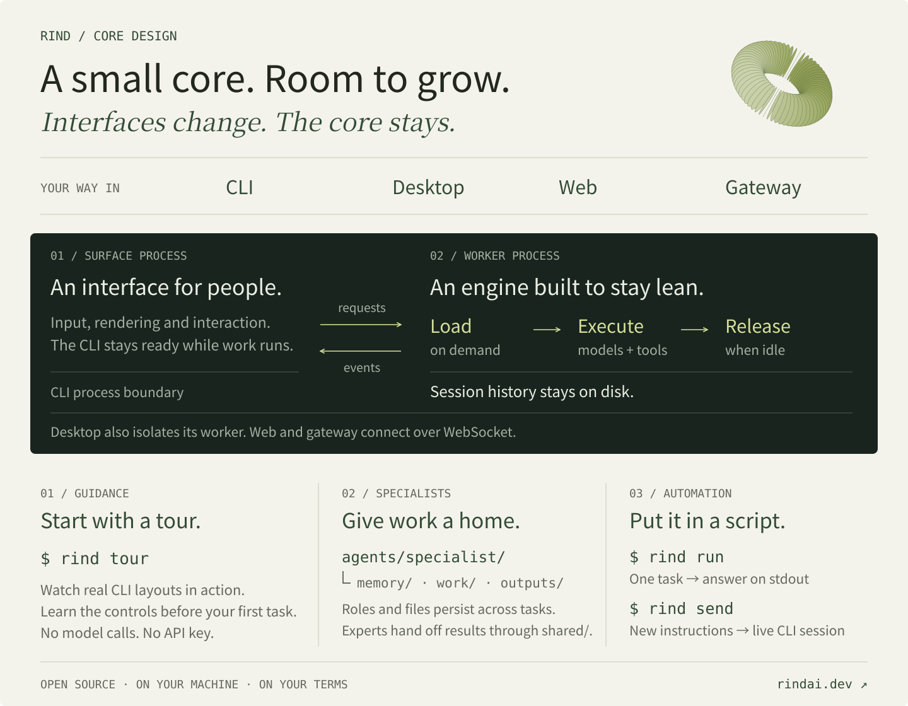

<p align="center">
  
</p>

<h1 align="center">Rind</h1>

<p align="center">
  <strong>A local coding agent you can use, automate, and rebuild.</strong>
</p>

<p align="center">
  Work with it in the terminal. Hand it a job. Split the work. Build your own surface.
</p>

<p align="center">
  English | <a href="README.zh-CN.md">简体中文</a>
</p>

<p align="center">
  <a href="https://github.com/Azzurroooo/rind/releases"></a>
  
  
  <a href="LICENSE"></a>
</p>

<p align="center">
  
</p>

## The point

Rind is a local-first coding agent for work that needs to keep moving. It can pair with you in a terminal or Desktop, answer one task from a script, or split focused work across a filesystem-native Team.

Rind is not a chat wrapper with tools glued on. Workspace access and agent execution stay in your process; model traffic goes only to the endpoint you configure. The core has a clear boundary, so every surface uses the same tools, turns, events, and protocol. Use the product as-is, or take the core apart and make it yours.

> Keep the center small. Let the work get bigger.

## Four ways to use it

| **Pair** | **Run** |
| --- | --- |
| Keyboard-first CLI or visual Desktop for coding, debugging, and exploration. | One-shot commands for CI, hooks, editor actions, and scheduled jobs. |
| **Delegate** | **Build** |
| A Team of focused agents sharing a project and a controlled workspace. | A small JSONL boundary for your editor, service, experiment, or new UI. |

### Pair with it

```bash
rind
```

Read and edit files, run shell commands, search the web, keep a plan, inspect skills, and watch the work stream as it happens. CLI and Desktop are different experiences on the same engine, so changing the surface does not change the agent.

```text
> You
  Trace the failing request, run tests, and fix what breaks.

* read   src/api/client.py
* bash   pytest -q
* edit   src/api/client.py

< Assistant
  Fixed the retry path. 12 tests passed.
```

### Run it headlessly

```bash
rind run --prompt "Summarize the changes in src/" --dir /workspace/project
```

One-shot mode is the same agent with the interactive layer removed:

- final assistant output goes to `stdout`;
- progress and diagnostics stay on `stderr`;
- `ask_user_question` is disabled by default, so automation cannot hang;
- `--session <id>` continues a task when a job needs context from an earlier run.

### Delegate the work

Team is filesystem-native and opt-in. Give the project a few focused agent profiles, then let the main agent delegate work without creating a second application or a second execution engine.

```text
.aiteam/
├── project.yaml
├── agents/
│   ├── reviewer/agent.yaml
│   └── weather/agent.yaml
└── shared/
```

```text
/team init       discover existing agent directories
/team list       inspect available agents
/team blueprint  browse user blueprints
/team add        create an agent from a blueprint
```

Each delegated job has an explicit session, workspace policy, tool set, and event stream. The same local engine handles creation, execution, cancellation, and result delivery.

## Why this shape works

### One core, any surface

The user-facing layer owns input and presentation. The local engine owns agent work and durable facts. A new client speaks the same JSONL protocol instead of reimplementing the turn loop.

```text
CLI / Desktop / your app
          |
          |  JSONL requests + session/update events
          v
      Rind Worker
          |
          +-- turns and cancellation
          +-- model adapter
          +-- tools and workspace
          +-- context and compaction
          +-- local session records
```

In the source, that local engine is a long-lived Python Worker. The name matters less than the boundary: sessions identify work, turns scope execution, and every event carries its session and turn identity.

### Small by default

Rind keeps the kernel to a short list of replaceable ports: model client, session store, tool registry, context manager, turn scheduler, and cancellation. Worker-level adapters are reused; turn state is temporary and released when work ends.

There is no required web stack, service mesh, or framework-sized dependency graph between your code and the agent loop.

### Composable tools

Shell, files, web retrieval, plans, skills, background work, and Team delegation are focused `ToolSpec` contracts. Add a capability by implementing a handler and registering its schema; the loop does not need to know its internals.

## For builders

Rind is intentionally easy to reshape:

| You want to add or replace | Start at |
| --- | --- |
| Model provider | `ChatClient` and its client factory |
| Model-facing capability | `ToolSpec` and `ToolRegistry` |
| Storage backend | `SessionStore` |
| Context policy | Context and compaction services |
| Human command | Worker command registry or a Surface command |
| New UI | JSONL protocol and `session/update` |
| Background workflow | Worker sessions and turn scheduling |

The public protocol stays compact:

```text
initialize
session/new       session/list       session/replay
session/prompt    session/cancel     session/switch
model/list        model/set          model/effort
rind/command/execute
session/update
```

`session/update` carries live and durable events with `session_id`, `turn_id`, sequence, and durability. You can render the stream, store it, or project it into another product without importing Python internals.

## Web Surface

Start a long-lived worker over WebSocket and connect the browser surface independently:

```bash
python main.py app-server --web --host 127.0.0.1 --port 8765 --cwd <workspace>
cd frontend-web
npm install
npm run dev -- --host 0.0.0.0
```

Open `http://localhost:5173`. Closing the browser only closes its WebSocket connection; the worker process and session execution continue running.

Omit `--session-dir` to use the same default `~/.rind/sessions` and session index as the CLI. When using a custom `--session-dir` or `RIND_HOME`, use the same value for both surfaces.

## Install

### Prebuilt CLI installers

Download the current CLI installer from [GitHub Releases](https://github.com/Azzurroooo/rind/releases):

- Windows x64: `.exe`
- macOS Intel: `.pkg`
- macOS Apple Silicon: `.pkg`
- Linux x64: `.deb`

Each installer includes the Node CLI and the matching native local engine. Desktop is distributed separately.

### npm

```bash
npm install -g @rind-ai/cli
rind --help
```

The CLI package selects the matching platform engine through optional dependencies.

### From source

```bash
git clone https://github.com/Azzurroooo/rind.git
cd rind
python -m venv .venv
```

On Windows PowerShell:

```powershell
.\.venv\Scripts\Activate.ps1
pip install -r requirements-runtime.txt
node frontend-cli/bin/rind.js
```

On macOS or Linux:

```bash
source .venv/bin/activate
pip install -r requirements-runtime.txt
node frontend-cli/bin/rind.js
```

Desktop (from source):

```bash
npm --prefix desktop install
npm --prefix desktop run dev
```

## Configure

Rind reads API settings from a complete `.rind/settings.json` in the active workspace. Without one, it falls back to `~/.rind/settings.json`.

```json
{
  "model": "your-model-name",
  "apiKey": "your-api-key",
  "baseUrl": "https://api.openai.com/v1",
  "reasoningEffort": "high"
}
```

Project settings are useful for isolated workspaces and Team agents. Keep API keys out of version control.

## Documentation

- [Architecture](docs/architecture.md)
- [CLI rendering](docs/cli-rendering.md)
- [CLI turn flow](docs/cli-turn-flow.md)
- [Main pipeline](docs/main_pipeline.md)

## Development

```bash
pip install -r requirements.txt
pytest test/ -q
```

CLI tests:

```bash
cd frontend-cli
npm install
npm test
```

## License

Rind is released under the [MIT License](LICENSE).
