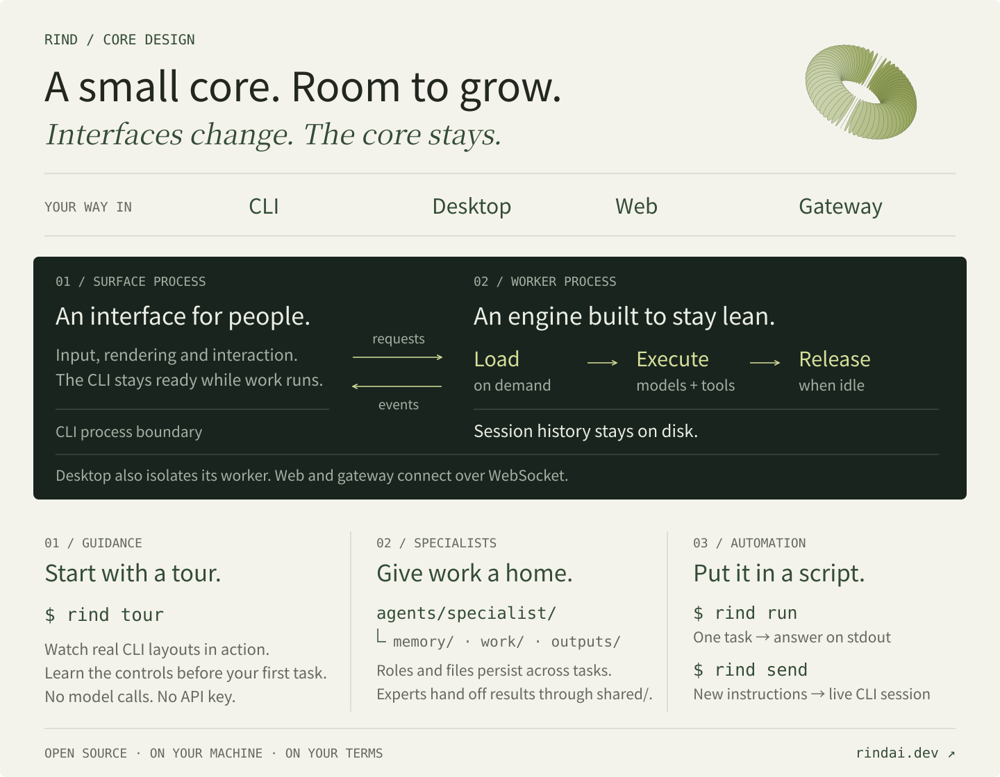

<p align="center">
  
</p>

<h1 align="center">Rind</h1>

<p align="center">
  <strong>A lightweight local coding agent — automate it, delegate to it, extend it, reach it from anywhere.</strong>
</p>

<p align="center">
  <a href="https://rindai.dev/">Website</a> · English | <a href="README.zh-CN.md">简体中文</a>
</p>

<p align="center">
  <a href="https://github.com/Azzurroooo/rind/releases"></a>
  <a href="https://www.npmjs.com/package/@rind-ai/cli"></a>
  <a href="LICENSE"></a>
</p>

Rind is a **lightweight, open-source AI coding agent** with persistent specialist workspaces, scriptable sessions, and a shared runtime for terminal, desktop, browser, and messaging clients. It runs on your machine and connects to your chosen model provider.

[See Rind in action on the website](https://rindai.dev/#tour): watch the CLI, built-in guide, specialist teams, and one-shot runs before installing.

- **[Build a reusable team](#persistent-multi-agent-teams).** Give specialists a lasting role, a working directory, and files they can build on across tasks.
- **[Put sessions into your workflow](#programmable-sessions).** Run an agent from a script or send new instructions into a live terminal session.
- **[Build on a lean worker](#a-lean-worker-independent-of-the-interface).** Separate the interface from execution, load sessions on demand, and extend the engine through clear interfaces.

<p align="center">
  
</p>

---

## Get started

Choose one of three ways to install the CLI:

### GitHub Releases

Download the installer for **Windows x64, macOS Intel / Apple Silicon, or Linux x64** from [Releases](https://github.com/Azzurroooo/rind/releases). After installation, open a terminal in your project and run `rind`.

### npm

Requires **Node.js 18+**:

```bash
npm install -g @rind-ai/cli
cd your-project
rind
```

### From source

Requires **Python 3.12+, Node.js 18+, and Git**:

```bash
git clone https://github.com/Azzurroooo/rind.git
cd rind
python -m venv .venv
```

Activate the environment with `source .venv/bin/activate` on macOS/Linux or `.\.venv\Scripts\Activate.ps1` in Windows PowerShell, then:

```bash
python -m pip install -r requirements-runtime.txt
node frontend-cli/bin/rind.js
```

For the examples below, source users can substitute `node /absolute/path/to/rind/frontend-cli/bin/rind.js` for `rind`.

Inside Rind, run `/login` to connect a provider, then `/model` to choose a model. Built-in adapters cover OpenAI, Anthropic, Google, DeepSeek, and more; custom OpenAI-compatible endpoints are configurable too. See the [setup guide](docs/getting-started.md) for configuration and other clients.

**Explore before spending tokens.** The interactive tour demonstrates real CLI layouts with simulated tasks: pause, rewind, and jump straight to a feature. It makes no model calls and needs no API key.

```bash
rind tour team.create
```

The tour is available on `main`, after v0.8.0; use the [source setup](docs/getting-started.md#from-source) to try it today. Run `rind tour` for the catalog, or `/tour` inside a session.

---

## Persistent multi-agent teams

**Connect any folders into a team, then let its leader coordinate delivery.** A finance member keeps its invoices; a developer works in a feature worktree. Workspaces, skills and files persist between assignments.

Open **`/agents`** for the team overview, member chats, tasks and reports. **`/manager`** opens a separate manager that can assemble and schedule teams using management tools. Ordinary member chats remain ordinary Rind sessions, with their team shown in the status bar.

```sh
rind agents team create product
rind agents team add product /path/to/project
rind agents team add product /path/to/reviewer --position Reviewer
rind agents task product project "Ask the reviewer to inspect the changes and deliver a concise report with evidence."
```

The first member becomes leader; use `rind agents team leader <team> <agent>` to change it. Team members need no manifest or prescribed directory tree. Add a shared folder only after explicitly choosing a copy or sharing. Shared directories run serially; separate worktrees can run in parallel. Child reports resume the leader automatically, while blockers name the person or member who must respond.

Delivery requires a report and confirmed execution completion. Uncertain runs stay marked **Unconfirmed** until reconciled. Private conversations stay private; files are shared through explicit artifact publication.

See [Agents Management](docs/agents-management.md) for source setup, worktrees, migration and recovery. `rind agents --help` lists the scriptable commands (`--json` supported).

---

## Programmable sessions

**Let a script start the work—or contribute to work already in progress.** Rind exposes both paths:

```bash
# Produce an answer that another program can consume.
rind run --prompt "Review the current diff for breaking API changes" > review.md

# Send an update from another terminal to an open Rind CLI session.
rind send --session <id> "The integration tests failed; investigate before continuing."
```

`run` writes the final answer to **stdout**, progress to **stderr**, and a Markdown run summary to `logs/` in the launching directory. User questions are disabled; failures return a nonzero exit code. Add `--session <id>` to continue a saved session or `--dir <absolute-path>` to choose the workspace.

With a current Worker, `run` waits for its managed background tasks and necessary follow-up turns, including tasks started during those turns, then prints one final answer. Long commands automatically release their initial waiting window and report completion without polling. Services started with `notify="manual"` do not hold the request open and stop when the Worker exits. Older Workers report that automatic background continuation is unavailable.

`send` addresses a running CLI session on the same machine: it starts a turn when idle and steers the current turn when busy. Find the session ID in the startup banner or `/status`. Delivery is acknowledged immediately; the answer appears in the target session. This lets a test watcher or local script contribute findings without taking over your terminal.

---

## A lean worker, independent of the interface

**The interface handles interaction. The worker runs the agent.** In the CLI, these are two separate processes: a Node.js surface and a Python worker, connected by JSONL requests and streamed events. The desktop app also launches the worker separately from its UI; Web and gateway clients connect to a long-lived worker over WebSocket.

This boundary keeps rendering and input handling out of the execution loop. A new client implements the protocol and reuses the engine's model calls, tools and cancellation.

**The worker is stateless with respect to durable session history.** Disk is the source of truth; active execution and coordination live in memory:

- **Load on demand.** A turn loads its session and creates the model client and execution objects it needs.
- **Release when idle.** Once a session has no active or queued work, its execution container is released and its model client is closed. Saved sessions do not each require a resident agent.
- **Keep the work on disk.** Messages and tool-call history persist as JSONL; subsequent turns reopen the saved session. Shared runtime services are reused across executions.

The result is a small idle execution footprint and clear extension boundaries: add clients, tools, or providers without coupling them to the UI. Running tasks still retain transient state for queues, cancellation, and live updates.

### One runtime, multiple clients

**Choose where you work; reuse the agent underneath.** The clients share the session protocol and runtime implementation:

| Client | What it gives you | Start here |
| --- | --- | --- |
| **CLI** | Direct terminal work and script integration | `rind` |
| **Desktop** | A visual workspace for multiple projects | [Run from source](docs/getting-started.md#desktop) |
| **Web** | Browser access to a long-lived worker | [Docker or local setup](docs/getting-started.md#web) |
| **Mobile** | Android/iOS remote access to Rind on your computer | [Build and connect](mobile/README.md) |
| **Messaging gateway** | Work through Telegram, Discord, Slack, Feishu, and other adapters | [Gateway setup](docs/getting-started.md#messaging-gateway) |

With the Web client, closing the browser leaves the worker running; reconnecting restores the session view. Local clients can reopen saved sessions when configured to use the same session store.

---

## Build on Rind

Rind separates clients, execution, and infrastructure. A custom interface consumes requests and `session/update` events; a new capability plugs into the tool registry.

| Extend | Entry point |
| --- | --- |
| Client or integration | [Runtime protocol](agent/runtime/server/protocol.py) |
| Model-facing tool | [ToolSpec](agent/infrastructure/tools/spec.py) and [tool registry](agent/infrastructure/tools/registry.py) |
| Provider or storage adapter | [Application ports](agent/application/ports) |
| Context assembly and compaction | [Context services](agent/application/context) |

For the design behind these boundaries, see [Architecture](docs/architecture.md), [CLI rendering](docs/cli-rendering.md), and [Tour internals](docs/cli-tour.md). For commands and shortcuts, use `/help` and `?` inside Rind.

The [development guide](docs/getting-started.md#development) covers setup and tests.

---

## Contributing

Keep contributions lightweight and complete, with clear interfaces, one-way dependencies, and no redundant code. Read the [contribution guidelines](CONTRIBUTING.md) before opening a pull request; [issues](https://github.com/Azzurroooo/rind/issues) are welcome too.

---

## License

[MIT](LICENSE)
