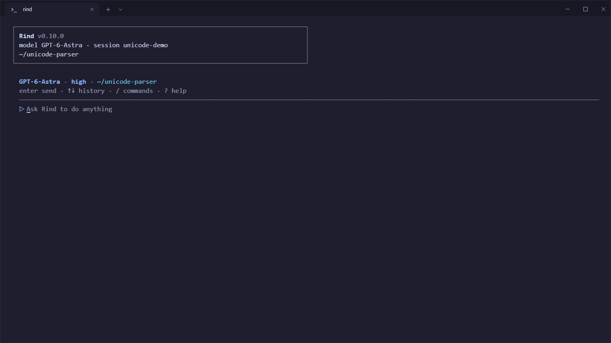
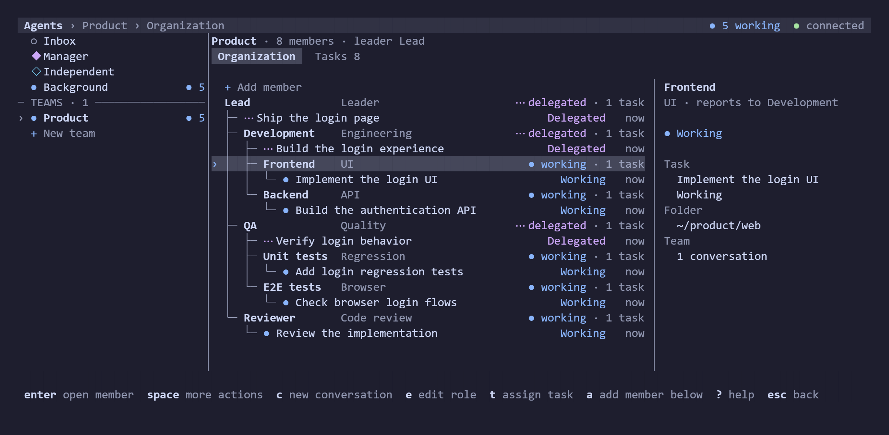
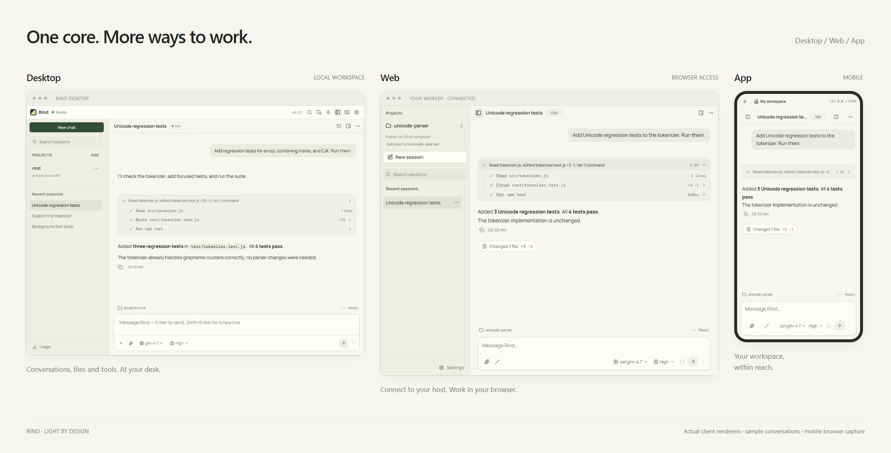

<p align="center">
  
</p>

<h1 align="center">Rind</h1>

<p align="center">
  <strong>Light by design. Folders are agents.</strong><br />
  A lightweight, open-source coding agent. Work locally. Build with a team.
</p>

<p align="center">
  <a href="https://rindai.dev/">Website & demos</a> · <a href="https://rindai.dev/docs/">Docs</a> · English | <a href="README.zh-CN.md">简体中文</a>
</p>

<p align="center">
  <a href="https://github.com/Azzurroooo/rind/releases"></a>
  <a href="https://www.npmjs.com/package/@rind-ai/cli"></a>
  <a href="LICENSE"></a>
</p>

<p align="center">
  <a href="assets/rind-cli-demo.mp4"></a><br />
  <sub>Read. Ask. Edit. Test. Deliver. · 15-second simulated CLI session · <a href="assets/rind-cli-demo.mp4">Watch the video</a></sub>
</p>

**Give your team a goal. Follow the work. Review the delivery.**

One agent for a quick fix. A team for a bigger goal. Rind keeps the work in your workspaces, the tools visible, and you in the conversation.

## Team Agents Management

### Folders are agents. Every folder is a teammate.

**Add workspaces to your team. Let each agent work in its own folder.**

A workspace gives an agent a place to work: files for context, `RIND.md` for standing instructions, and skills for reusable expertise. Give it a role, connect it to the team, and let specialists work in parallel. Your existing directories can stay where they are; Git worktrees offer separate working copies when you need them.

<p align="center">
  <a href="assets/agents-management.png"></a><br />
  <sub>Rind CLI · Agents Management · example team · click to enlarge</sub>
</p>

- **One goal. Different responsibilities.** The lead delegates, specialists implement, test and review, and reports return for the lead to check before delivery to you.
- **Coordination you can see.** Organization shows the team and reporting relationships; Tasks tracks the work; Inbox brings questions and deliveries to you. Background keeps ongoing work visible.
- **Your structure, not a template.** A development team, research desk or personal assistant network. Choose the roles, workspaces and reporting lines that fit your work.

The folder is the agent's home; a conversation is one session of its work. Team membership does not require a permanently loaded execution engine for every member.

[Explore Agents Management →](docs/agents-management.md)

## Light by design. Work on demand.

**Keep the work. Release the weight.**

Rind separates lasting context from temporary execution. Conversation history lives in files on disk, not only in a resident agent's memory. When a session has work, the shared Worker assembles its execution context; when the turn is idle and nothing is queued, it releases the execution container and model client. The next turn reloads the saved context.

- **Shared infrastructure, independent workspaces.** Sessions reuse Worker services without keeping an execution container alive for every saved conversation.
- **History outlives execution.** Resume a conversation without needing its old execution objects to remain in memory. No database service to maintain.
- **Background work has its own lifetime.** Managed shell processes can continue after a turn's container is released; the Worker still owns their output, status and cancellation.

“Stateless” describes how persistent session context is restored—not a Worker with no live state. Active processes, queues and cancellation still have clear owners. Low load comes from **loading what is needed and releasing what is idle**, not from discarding your history.

[Inside the lightweight Worker →](docs/internals/01-runtime/resource-ownership.md)

## One core. More ways to work.

**At your desk. In your browser. On your phone.**

<p align="center">
  <a href="assets/rind-clients.png"></a><br />
  <sub>Desktop · Web · App · real client renderers with sample data · click to enlarge</sub>
</p>

- **Desktop.** A local visual workspace for conversations, project files and tool results. [Download v0.9.0 for Windows, macOS or Linux](https://github.com/Azzurroooo/rind/releases/tag/v0.9.0).
- **Web.** Connect from a browser through Desktop remote access, or self-host the Web surface with a standalone Worker. [Web setup →](docs/internals/07-surfaces/web-and-mobile.md)
- **App.** Continue host-side sessions from your phone. The mobile client connects to your computer or server; models, tools and files stay on the host. [Android / iOS source and build guide →](mobile/README.md)

The interfaces share a runtime, not an identical feature set. **Team Agents Management is currently available in CLI 0.10.0.** Mobile is a remote client, not an on-device coding runtime; native builds require the platform toolchains.

## Your models, your choice.

**Use your ChatGPT subscription. Or bring your own API keys.**

Rind supports OpenAI account sign-in alongside API-key connections to OpenAI, Anthropic, Google, DeepSeek and other compatible providers. Choose the model that fits the work; keep using Rind's tools and local workspaces. Available subscription models and usage depend on your account and plan.

## Get started

**CLI — open your project and start a conversation.**

```bash
npm install -g @rind-ai/cli
cd your-project
rind
```

Inside Rind, use `/login` to connect a provider and `/model` to choose a model. For a ChatGPT subscription, choose **OpenAI → Sign in with an account** and complete the browser sign-in. Available models and usage depend on your account and plan.

Want a quick look first? [Explore the interactive demos](https://rindai.dev/#tour), or open `/tour` inside Rind. The built-in tour needs no API key.

<details>
<summary>CLI requirements, standalone downloads and source setup</summary>

The npm CLI requires Node.js 18+ and supports Windows, macOS and Linux. Standalone CLI packages are available on [Releases](https://github.com/Azzurroooo/rind/releases).

To run from source, install Python 3.12+, Node.js 18+ and Git, then follow the [source setup guide](docs/internals/07-surfaces/interactive-cli.md#running-from-source).

</details>

## More ways to work

- **Bring Rind into your channels.** Connect [Telegram, Discord, Slack and Feishu](docs/internals/07-surfaces/gateway.md).
- **Automate when it helps.** Use `rind run` for scripts and CI, or `rind send` to steer a running conversation. Team management also has a command-line API.

<details>
<summary>For developers: extend Rind or reuse its parts</summary>

Rind separates the runtime from its interfaces. Build another client on the [runtime protocol](agent/runtime/server/protocol.py), add a [tool](agent/infrastructure/tools/spec.py), or reuse the standalone [Agents Management service](agent-management).

Explore the [internals](docs/README.md), [system map](docs/internals/00-architecture/system-map.md) and [development guide](docs/internals/08-engineering/verification.md).

</details>

## Contributing

Contributions and [issues](https://github.com/Azzurroooo/rind/issues) are welcome. See [CONTRIBUTING.md](CONTRIBUTING.md).

[MIT License](LICENSE)
