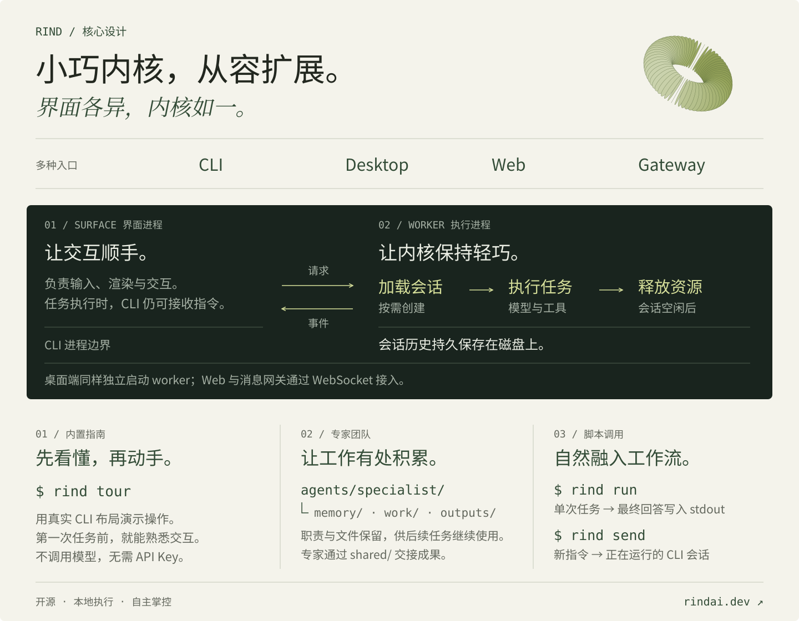

<p align="center">
  
</p>

<h1 align="center">Rind</h1>

<p align="center">
  <strong>组建你的 Agent 团队，让每次工作都有积累。</strong>
</p>

<p align="center">
  <a href="README.md">English</a> | 简体中文
</p>

<p align="center">
  <a href="https://github.com/Azzurroooo/rind/releases"></a>
  <a href="https://www.npmjs.com/package/@rind-ai/cli"></a>
  <a href="LICENSE"></a>
</p>

Rind 是一个支持**多智能体协作**的**开源 AI 编码 Agent**：为专家建立持久工作区，让会话接入脚本，并通过同一套运行时连接终端、桌面、浏览器和消息平台。它在你的机器上运行，连接你选择的模型供应商。

- **[组建可复用的专家团队](#持久化-agent-团队)**：每个专家都有长期职责、工作目录，以及可供后续任务继续使用的文件。
- **[让会话进入工作流](#可编程的会话)**：从脚本执行任务，也能向正在运行的终端会话投递新指令。
- **[基于轻量 worker 扩展](#独立于界面的轻量-worker)**：界面与执行分进程运行，会话按需加载，通过清晰接口扩展引擎。

<p align="center">
  
</p>

---

## 快速开始

CLI 提供三种安装方式，任选其一：

### GitHub Releases

从 [Releases](https://github.com/Azzurroooo/rind/releases) 下载 **Windows x64、macOS Intel / Apple Silicon 或 Linux x64** 安装包。安装后，在项目目录打开终端并运行 `rind`。

### npm

需要 **Node.js 18+**：

```bash
npm install -g @rind-ai/cli
cd your-project
rind
```

### 从源码运行

需要 **Python 3.12+、Node.js 18+ 和 Git**：

```bash
git clone https://github.com/Azzurroooo/rind.git
cd rind
python -m venv .venv
```

macOS/Linux 使用 `source .venv/bin/activate`，Windows PowerShell 使用 `.\.venv\Scripts\Activate.ps1` 激活环境，然后执行：

```bash
python -m pip install -r requirements-runtime.txt
node frontend-cli/bin/rind.js
```

阅读下方示例时，源码用户可用 `node /absolute/path/to/rind/frontend-cli/bin/rind.js` 替换 `rind`。

进入 Rind 后，用 `/login` 连接模型供应商，再用 `/model` 选择模型。内置适配支持 OpenAI、Anthropic、Google、DeepSeek 等供应商，也可配置自定义 OpenAI 兼容端点。详细配置与其他客户端的启动方式见[安装与配置指南](docs/getting-started.zh-CN.md)。

**先看懂，再动手。** 交互导览用真实 CLI 布局演示模拟任务，支持暂停、回看和直接跳转到某个功能；不调用模型，也不需要 API Key。

```bash
rind tour team.create
```

导览已合并到 `main`，尚未包含在 v0.8.0 中；现在可通过[源码安装](docs/getting-started.zh-CN.md#从源码运行)体验。运行 `rind tour` 打开目录，也可在会话内输入 `/tour`。

---

## 持久化 Agent 团队

**把反复出现的工作交给有固定工作区的专家。** 测试专家可以持续维护测试样例和注意事项，研究专家可以保存调研结论与参考材料；下次任务到来时，这些积累仍在。

一个 Team 就是一组普通目录。主代理负责协调专家，`shared/` 承载它们交换的文件：

```text
my-project/
├── .aiteam/project.yaml         # Team 信息与主代理选择
├── agents/
│   ├── main-agent/              # 协调者的工作区
│   └── test-specialist/
│       ├── .aiteam/agent.yaml   # 专家身份
│       ├── .aiteam/prompts/     # 职责指令
│       ├── memory/             # 值得保留的笔记
│       ├── work/               # 工作文件
│       └── outputs/            # 本地成果
└── shared/                     # 共享输入与正式交付
```

每次执行委派都会创建独立、可持久保存的会话。**跨任务延续的是专家职责和文件**：新任务可以检查已有成果，旧对话则作为独立记录保留。主代理收到简明结果和已发布文件的路径，可以直接核验交付物。

互不依赖的任务可以并发委派。专家通过文件工具访问自己的工作区和共享目录，让内部工作材料与正式交付保持清晰边界。

### 组建第一支团队

先在项目根目录启动 Rind，然后输入：

```text
/team create
/exit
```

创建 Team 不会自动切换当前会话。回到终端，进入协调者工作区重新启动：

```bash
cd agents/main-agent
rind
```

接着在 Rind 中输入：

```text
/team add 一个负责回归测试、持续维护测试笔记的测试专家
/team list
```

把待处理材料放入项目的 `shared/` 目录，再向主代理提出任务：

> 委派测试专家检查 shared/parser/，编写 Unicode 回归测试，并将测试文件和简短交接说明发布到 shared/。

指定专家时可使用 `/team list` 显示的 Agent ID。按 **Ctrl+B** 查看委派进度。需要在其他项目复用专家配置时，可以把模板放在 `~/.rind/blueprints/`，再通过 `/team blueprint` 创建专家。

---

## 可编程的会话

**让脚本发起工作，也让脚本参与正在进行的工作。** Rind 为两种场景提供了直接入口：

```bash
# 生成可供其他程序使用的结果。
rind run --prompt "检查当前 diff 是否包含破坏性 API 变更" > review.md

# 从另一个终端向已打开的 Rind CLI 会话发送更新。
rind send --session <id> "集成测试失败了，请先排查再继续。"
```

`run` 将最终回答写入 **stdout**、进度写入 **stderr**，并在启动目录的 `logs/` 下保存 Markdown 运行摘要。运行时关闭用户提问，失败返回非零退出码。加上 `--session <id>` 可续接已保存会话，`--dir <absolute-path>` 可指定工作区。

`send` 通过会话 ID 找到同一台机器上正在运行的 CLI：空闲时启动新一轮任务，忙碌时将指令送入当前任务。会话 ID 可在启动 banner 或 `/status` 中查看。投递成功后立即确认，回答出现在目标会话中。测试监听器或本地脚本因此可以持续补充信息，无需接管你的终端。

---

## 独立于界面的轻量 worker

**界面负责交互，worker 负责执行。** CLI 采用双进程设计：Node.js surface 与 Python worker 分别运行，通过 JSONL 请求和流式事件通信。桌面端同样将 worker 与 UI 分进程运行；Web 和消息网关则通过 WebSocket 连接常驻 worker。

这条边界把渲染、输入处理与 Agent 执行循环分开。新增客户端只需实现协议，即可复用引擎中的模型调用、工具、委派与取消机制。

**worker 对持久会话历史采用无状态设计。** 磁盘是持久状态的来源，内存承载当前执行与协调：

- **按需加载**：任务开始时读取会话，创建所需的模型客户端和执行对象。
- **空闲释放**：会话没有正在运行或排队的任务后，释放执行容器并关闭模型客户端。无需为每个已保存会话保留一个常驻 Agent。
- **成果落盘**：消息和工具调用历史以 JSONL 持久保存，后续任务重新打开会话；通用运行时服务在不同执行之间复用。

这让内核减少空闲时的执行资源占用，同时保持清晰的扩展边界：客户端、工具和供应商都可独立扩展，无需与 UI 耦合。运行中的任务仍保留队列、取消信号和实时更新等临时状态。

### 一个运行时，多个客户端

**选择适合当下的工作界面，复用同一个 Agent 引擎。** 各客户端共享会话协议和运行时实现：

| 客户端 | 适用场景 | 从这里开始 |
| --- | --- | --- |
| **CLI** | 终端交互、脚本集成 | `rind` |
| **Desktop** | 可视化管理多个项目 | [从源码启动](docs/getting-started.zh-CN.md#桌面端) |
| **Web** | 通过浏览器连接常驻 worker | [Docker 或本地部署](docs/getting-started.zh-CN.md#web-端) |
| **消息网关** | 通过 Telegram、Discord、Slack、飞书等适配器工作 | [网关配置](docs/getting-started.zh-CN.md#消息网关) |

使用 Web 端时，关闭浏览器不会终止 worker 中的任务；重新连接后恢复会话视图。本地客户端配置为使用同一个会话存储目录时，也可以重新打开已有会话。

---

## 基于 Rind 扩展

Rind 将客户端、执行过程和基础设施分开。自定义界面收发请求与 `session/update` 事件，新能力通过工具注册表接入。

| 扩展方向 | 源码入口 |
| --- | --- |
| 客户端与集成 | [运行时协议](agent/runtime/server/protocol.py) |
| 模型可调用的工具 | [ToolSpec](agent/infrastructure/tools/spec.py) 与[工具注册表](agent/infrastructure/tools/registry.py) |
| 模型或存储适配器 | [应用层接口](agent/application/ports) |
| 上下文组装与压缩 | [上下文服务](agent/application/context) |

设计细节见[架构](docs/architecture.md)、[CLI 渲染](docs/cli-rendering.md)与[导览实现](docs/cli-tour.md)（英文）。完整命令和快捷键可在 Rind 内通过 `/help` 和 `?` 查看。

欢迎提交 [Issue](https://github.com/Azzurroooo/rind/issues) 或 Pull Request；开发环境和测试命令见[开发指南](docs/getting-started.zh-CN.md#开发与测试)。

---

## 许可证

[MIT](LICENSE)
