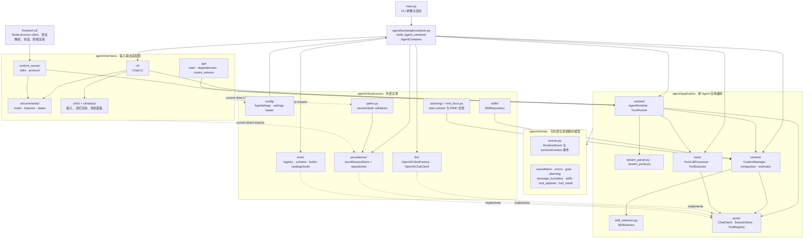
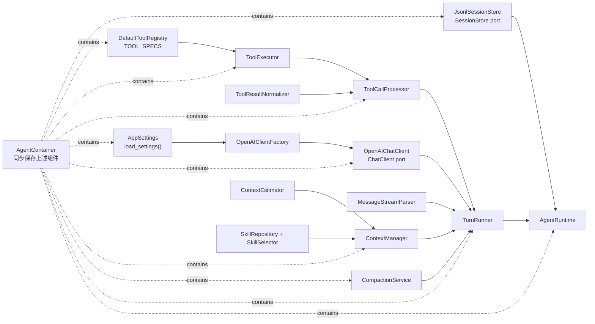
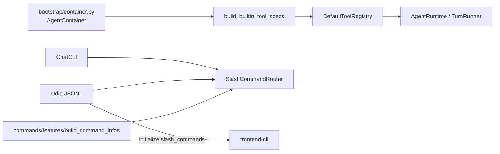
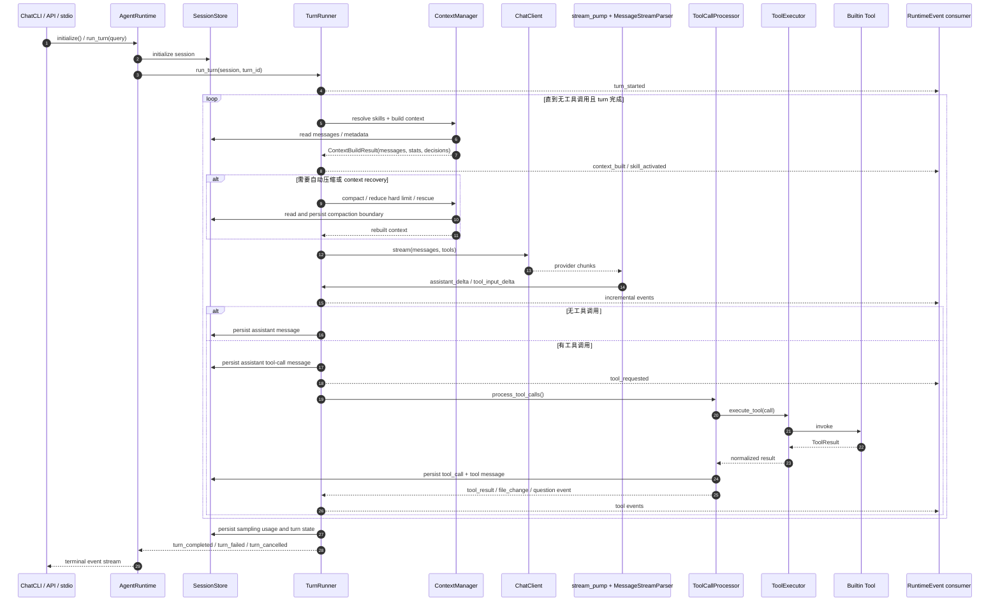
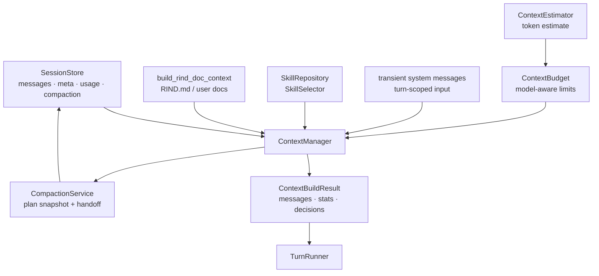
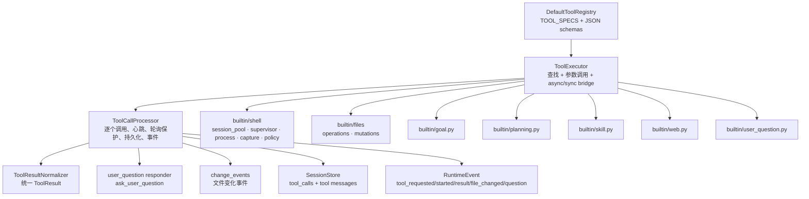
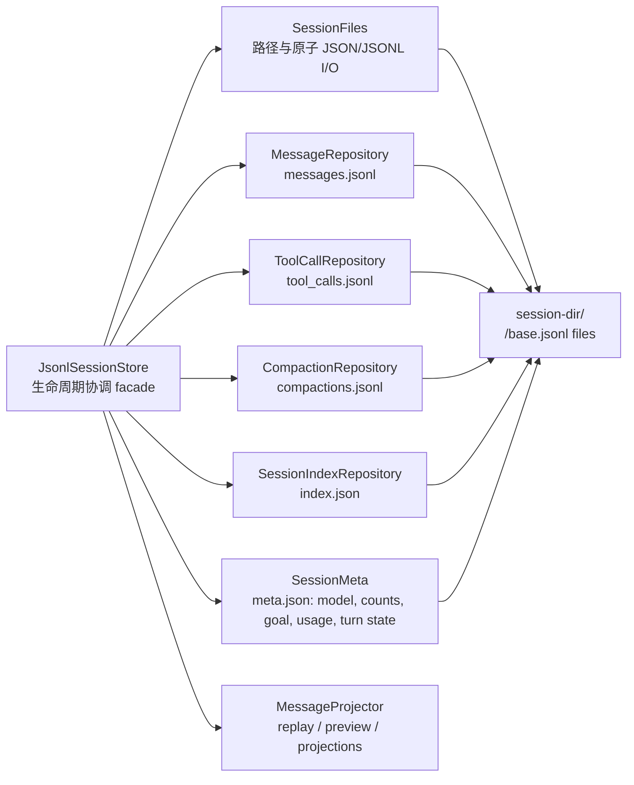
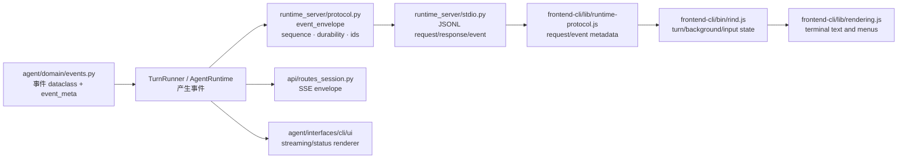
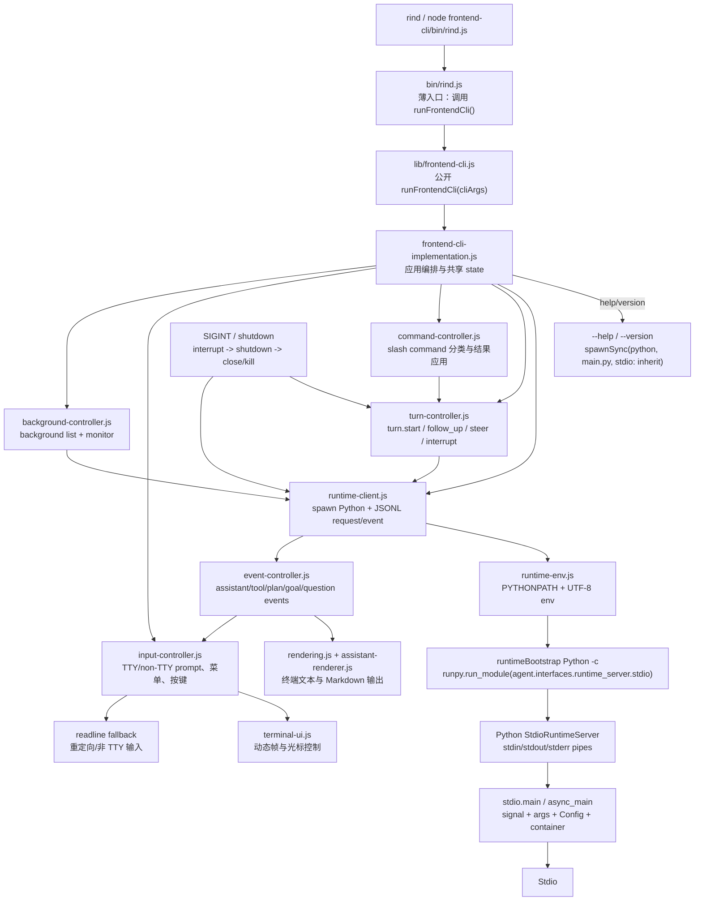

# Rind 当前代码架构

> 本文以当前代码为准，描述单 Agent runtime、CLI/API 接口、工具执行、上下文管理、事件协议和 JSONL session 持久化。图中的“当前边界”反映实际代码，不代表未来重构目标。

## 1. 系统分层与依赖方向



### 依赖规则

| 层 | 当前职责 | 允许依赖 | 不应承载 |
| --- | --- | --- | --- |
| `domain` | 事件、错误、边界模型、取消令牌 | Python 标准库 | provider、文件、终端、HTTP |
| `application` | turn、context、tool、skill 的应用编排 | `domain`、`ports` | 具体 OpenAI、JSONL、CLI 输出 |
| `infrastructure` | LLM、session、工具、配置、规划、文档的具体实现 | `domain`、`application.ports` | CLI/API 处理 |
| `interfaces` | CLI、API、stdio、协议和展示 | runtime/use case；当前仍有少量具体 infrastructure import | 核心 turn 策略、文件持久化细节 |
| `bootstrap` | 显式创建并连接依赖 | 所有实现层 | 运行时业务逻辑 |

当前架构测试已经阻止 application 反向依赖 infrastructure，也确保入口使用共享 `build_agent_container`。接口层的 concrete import 和 session 私有字段穿透仍是现状边界，见阶段重构计划。

## 2. Composition Root 与实际对象图



`build_agent_container()` 的实际创建顺序是：settings/provider factory -> session store -> tool registry/executor/normalizer/processor -> LLM client -> stream parser -> context estimator/skill components/context manager -> compaction service -> turn runner -> runtime。

`AgentContainer` 是 dataclass facade，保存运行时需要的对象；`main.py` 只取 `container.runtime` 和 `container.session_store` 创建 `ChatCLI`。API、stdio 使用同一 composition root，不应自行复制这一组装流程。

### 能力注册边界



- `agent/infrastructure/tools/builtin/__init__.py` 只按固定顺序组合各工具模块的 `TOOL_SPECS`；`AgentContainer` 在构造 registry 前筛选 `enabled_tools`。
- `agent/interfaces/cli/commands/features/` 是 slash command 的唯一内置 catalog。每个功能模块提供自己的 `SlashCommandInfo` 和 handler，router 负责校验名称、alias 和分发。
- `ChatCLI` 与 stdio 都从 router 读取注册结果；frontend-cli 只消费 `initialize.slash_commands` 生成菜单、帮助和补全，不维护另一份命令目录。

## 3. 一次 turn 的运行时结构



### Runtime 的状态与控制入口

`AgentRuntime` 维护 session-bound runtime 的运行状态：

- `_initialized` 与初始化锁：保证 session store 只初始化一次；
- `_turn_lock`：禁止并行 turn、session switch、goal replacement；
- `_active_turn_id`、`_accepting_inputs`：标记可接收 steering/follow-up 的窗口；
- steering queue 与 follow-up queue：分别在当前 turn 中改变方向、或当前 turn 结束后追加输入；
- goal continuation：turn 完成后读取 active goal，必要时继续执行；
- terminal event persistence：保存 turn state 和最终事件。

控制请求由 stdio/API 映射到 runtime：`turn.start`、`turn.interrupt`、`turn.steer`、`turn.follow_up`、`model.set`、`session.switch`、`compact`、`goal.*`。

## 4. 上下文与压缩结构



`ContextManager` 当前负责：读取持久消息、注入 RIND 文档和 skills、处理临时 system message、估算 token、判断 compact、执行 hard-limit rescue，并返回统计与决策。它不调用 LLM，也不执行工具。

`CompactionService` 通过 `build_plan_snapshot()` 获取计划摘要，生成 compact/handoff 结果；session store 负责实际持久化 compaction 记录和消息边界。

## 5. 工具调用结构



工具执行顺序是：解析 provider tool call -> registry 查找 -> executor 调用 -> 结果归一化 -> 必要时等待用户 -> 持久化工具调用和工具消息 -> 发出事件 -> 将结果追加回下一轮 context。

## 6. Session 持久化结构



Session store 同时提供 application `SessionStore` port 所需能力：initialize/discard/switch、message/tool persistence、recent sessions、resume preview、model metadata、sampling usage、turn state、goal 和 compaction。当前 `JsonlSessionStore` 是 facade，底层 repository 已按文件类型拆开。

## 7. Runtime 事件与传输



事件分为 durable 和 incremental：assistant/tool input delta 属于增量事件，tool result、turn completed、turn failed 等需要持久化或恢复的状态属于 durable 事件。Python envelope 与 JS protocol 共同消费 `test/fixtures/runtime_protocol.golden.jsonl`。

## 8. frontend-cli（ts_cli 启动链）

仓库中没有独立的 `ts_cli` 目录；当前终端客户端实际位于 `frontend-cli/`，入口是 Node ESM 文件 `frontend-cli/bin/rind.js`。它不是直接调用 Python CLI，而是启动一个 Python stdio runtime 子进程，再通过 JSONL 控制协议驱动交互。



### frontend-cli 文件职责

| 文件 | 启动链中的职责 |
| --- | --- |
| `bin/rind.js` | 薄启动入口，只导入 `runFrontendCli()` 并传入 CLI 参数 |
| `lib/frontend-cli.js` | frontend-cli 公开入口，转发到实际应用编排 |
| `lib/frontend-cli-implementation.js` | 应用层装配：repoRoot、快速路径、initialize、controllers、共享 state、shutdown |
| `lib/runtime-client.js` | Python child process、stdout JSONL 分包、request pending、event 转发、shutdown/kill |
| `lib/turn-controller.js` | turn.start、turn.follow_up、turn.steer、interrupt 和 turn 生命周期状态 |
| `lib/command-controller.js` | 普通文本、slash command、本地交互命令、slash result 应用 |
| `lib/input-controller.js` | TTY/non-TTY prompt、line editor、菜单、暂停/恢复、用户问题输入 |
| `lib/event-controller.js` | assistant 流式输出、工具事件、plan/goal、user question、turn 结束状态 |
| `lib/background-controller.js` | background task 列表、结果合并、monitor 进入/退出与轮询 |
| `lib/runtime-env.js` | 为 Python child 构造 `PYTHONPATH`、UTF-8 和环境变量 |
| `lib/runtime-protocol.js` | 创建 request、读取 request id、识别 event type、选择 `turn.start`/`turn.follow_up` |
| `lib/terminal-ui.js` | TTY 动态帧、光标和外部输出暂停/恢复 |
| `lib/line-editor.js`、`terminal-key.js` | 非 TTY/TTY 输入编辑、按键解析、宽字符光标处理 |
| `lib/*-state.js` | compact、model、slash、choice、interrupt 等局部交互状态 |
| `lib/rendering.js`、`assistant-renderer.js` | startup、prompt、tool/status、markdown assistant 输出 |

启动后存在两条输入模式：TTY 通过 `input-controller` 调用 `createTerminalUI()`、line editor 和菜单状态；非 TTY 通过 Node `readline` 与 stdin data listener。两条路径共享 `turn-controller`、`command-controller`、`runtime-client`、runtime event 分发和最终 shutdown。

## 9. 当前目录结构

```text
.
├── main.py
├── agent/
│   ├── bootstrap/
│   │   └── container.py                 # AgentContainer 与唯一生产组装入口
│   ├── domain/
│   │   ├── events.py                    # runtime/tool/context/turn 事件
│   │   ├── cancellation.py              # CancellationToken
│   │   ├── errors.py                    # 领域与 provider/persistence 错误
│   │   ├── message_boundary.py          # model/compact 消息边界校验
│   │   ├── compaction.py goal.py planning.py skills.py
│   │   └── tool_payload.py tool_result.py
│   ├── application/
│   │   ├── runtime/
│   │   │   ├── runtime.py               # AgentRuntime facade、输入队列、控制操作
│   │   │   ├── turn_runner.py            # 单 turn 主循环
│   │   │   ├── stream_parser.py          # provider stream 解析
│   │   │   └── stream_pump.py            # stream -> RuntimeEvent
│   │   ├── context/
│   │   │   ├── manager.py                # context 组装、预算与 rescue
│   │   │   ├── compaction.py             # compact service
│   │   │   ├── estimator.py token_usage.py handoff.py
│   │   ├── tools/
│   │   │   ├── processor.py              # 工具调用循环与结果持久化
│   │   │   ├── executor.py               # registry lookup 与工具调用
│   │   │   ├── result_normalizer.py
│   │   │   ├── change_events.py polling_guard.py
│   │   ├── ports/                         # ChatClient/SessionStore/ToolRegistry
│   │   └── skill_selection.py
│   ├── infrastructure/
│   │   ├── config/ llm/ paths.py
│   │   ├── persistence/                   # JsonlSessionStore 与 repositories
│   │   ├── tools/                         # registry/schema/builtin tools
│   │   ├── skills/                        # SkillRepository
│   │   ├── planning/ rind_docs.py         # plan 与 RIND 文档
│   ├── interfaces/
│   │   ├── cli/                           # ChatCLI、commands、ui、status
│   │   ├── api/                           # FastAPI 应用与 session route
│   │   └── runtime_server/                # stdio server 与 versioned protocol
│   └── prompts.py                         # SYSTEM_PROMPT 与 goal prompt
├── frontend-cli/
│   ├── bin/rind.js                        # 薄 Node 启动入口
│   ├── lib/                               # runtime client、controllers、protocol、输入、状态、渲染模块
│   └── test/
├── sessions/                              # 运行时 session artifact
└── test/                                  # Python 单元、协议和集成测试
```

## 10. 关键边界与阅读顺序

要理解整个项目，建议按以下顺序阅读：

1. `main.py`：确认启动参数、配置校验和 `build_agent_container()`。
2. `agent/bootstrap/container.py`：确认所有生产对象如何连接。
3. `agent/application/runtime/runtime.py`：理解 turn lock、输入队列、goal 和 session control。
4. `agent/application/runtime/turn_runner.py`：理解 context -> model -> tool -> continuation 主循环。
5. `agent/application/context/manager.py` 与 `context/compaction.py`：理解 token budget、skills、RIND docs 和 compact。
6. `agent/application/tools/processor.py` 与 `tools/executor.py`：理解工具结果、问答、文件变化和持久化。
7. `agent/infrastructure/persistence/jsonl_session_store.py`：理解 session 文件与 repositories。
8. `agent/interfaces/runtime_server/stdio.py`、`api/routes_session.py`、`cli/chat_cli.py`：理解三种输出和控制入口。
9. `frontend-cli/bin/rind.js`、`lib/frontend-cli-implementation.js`、`lib/runtime-client.js`、`lib/*-controller.js`：理解 Node CLI 如何启动 Python runtime、路由输入并消费事件。
