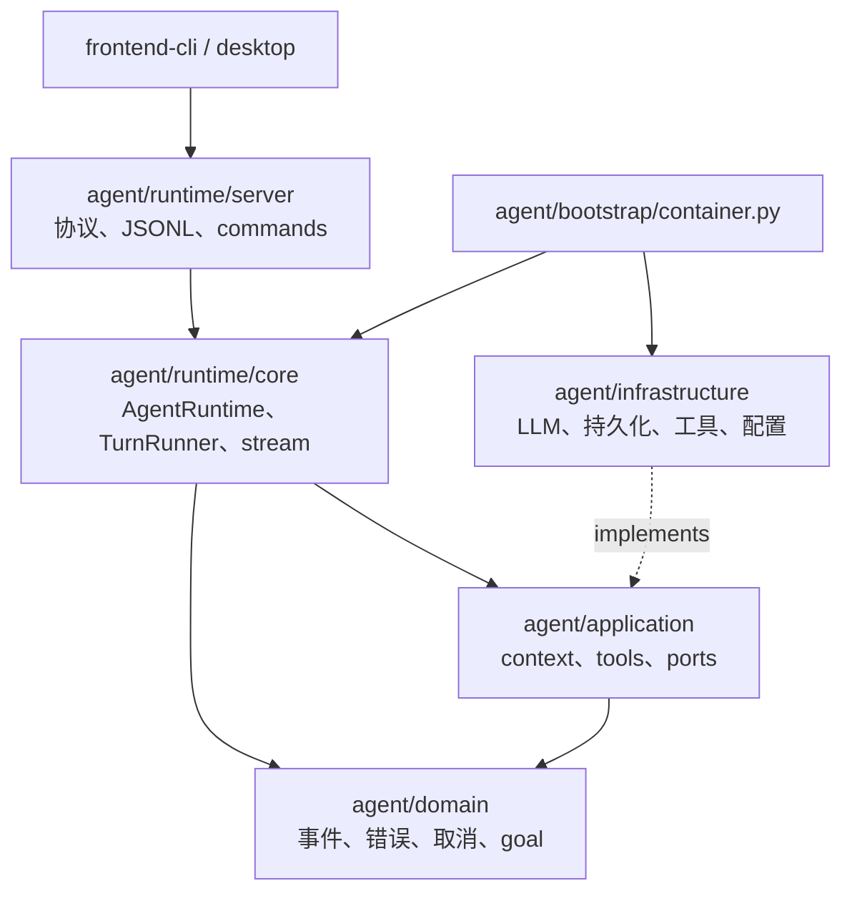
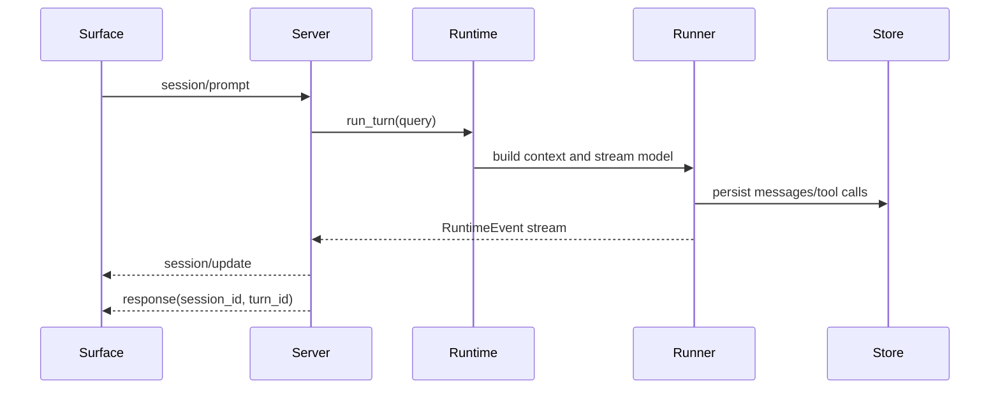

# Rind 当前代码架构

Rind 由两个产品 Surface 共享一个 Runtime Package：`frontend-cli` 提供终端体验，`desktop` 提供 Electron 界面。Python 入口不再承载交互 UI，只启动 Runtime Server。

## 分层



- `domain` 只包含领域模型和标准库逻辑。
- `application` 编排 context、tool、skill 和 ports，不依赖具体 provider 或 Surface。
- `runtime/core` 是执行核心，拥有 turn 生命周期、输入队列和事件流。
- `runtime/server` 是统一 Server facade，负责协议分发、能力声明、session/model/goal/background 控制和可复用 command catalog。
- `infrastructure` 实现 LLM、JSONL session store、工具注册、配置和 workspace 集成。
- `bootstrap` 是唯一生产组合根；Server 通过 `build_agent_container()` 获取依赖。

`runtime/core` 不导入 `runtime/server`、`bootstrap` 或具体 infrastructure。Server 与 core 在同一个进程内直接调用，没有内部 RPC 或重复的 runtime dependency object。

## Runtime Package

```text
agent/runtime/
├── __init__.py
├── core/
│   ├── runtime.py          # AgentRuntime facade、turn lock、输入队列、session control
│   ├── turn_runner.py      # context -> model -> tool 主循环
│   ├── stream_parser.py    # provider stream 解析
│   └── stream_pump.py      # stream -> RuntimeEvent
└── server/
    ├── app_server.py       # workspace/config/container 启动
    ├── protocol.py         # v2 方法、capabilities、envelope、errors
    ├── stdio.py            # JSONL transport 与 request dispatcher
    ├── resume_preview.py   # session 恢复摘要
    └── commands/            # command catalog 与 runtime-safe handlers
```

## Surface 协议

协议由 `agent/runtime/server/protocol.py` 定义，前端镜像在 `frontend-cli/lib/runtime-protocol.js`，Desktop 的允许方法由 `desktop/src/preload/types.ts` 派生。公共方法使用标准语义：

`initialize`、`shutdown`、`session/new`、`session/list`、`session/switch`、`session/replay`、`session/prompt`、`session/cancel`、`model/list`、`model/set`。

产品扩展使用 `rind/` 命名空间，并由能力声明门控：`rind/session/steer`、`rind/session/follow_up`、`rind/session/compact`、`rind/command/execute`、`rind/user-question/respond`、`rind/goal/*`、`rind/background/*`。

事件统一为 `method: "session/update"` 的 envelope，包含 `sequence`、`durability`、session/turn ids 和 `event.type`。增量事件可实时消费，durable 事件用于恢复和状态同步。公共 fixture 位于 `test/fixtures/runtime_protocol.golden.jsonl`。

## 主要数据流



控制请求不会复制业务逻辑：Server 调用 Runtime 的 `set_model`、`switch_session`、`compact_context`、goal API 和输入队列；命令 handler 通过 `SlashCommandContext` 使用同一个 runtime/session 实例。

## 入口

```text
frontend-cli/bin/rind.js
  -> frontend-cli/lib/runtime-client.js
     -> python main.py app-server --stdio
        -> agent/runtime/server/app_server.py
           -> agent/bootstrap/container.py

desktop/src/main/index.ts
  -> desktop/src/main/runtime.ts
     -> python main.py app-server --stdio
```

`desktop` 主进程隔离 worker、IPC 和项目状态；renderer 只通过 preload API 访问 runtime。`frontend-cli` 负责 TTY/non-TTY 输入、菜单、文本和 Markdown 渲染。两者都消费同一套方法、事件和能力。

## 测试边界

- Python 测试覆盖 `runtime/core`、`runtime/server`、application/infrastructure 和协议 fixture。
- `frontend-cli/test` 覆盖协议、controller、输入状态和渲染。
- `desktop/scripts` 覆盖 fake runtime 生命周期、项目/session adapter 和 app-server smoke；需要 Node 22+ 才能直接运行 TypeScript 源测试。
- Python 交互 CLI、prompt renderer 和对应测试已删除；Python CLI 不再是产品入口。
