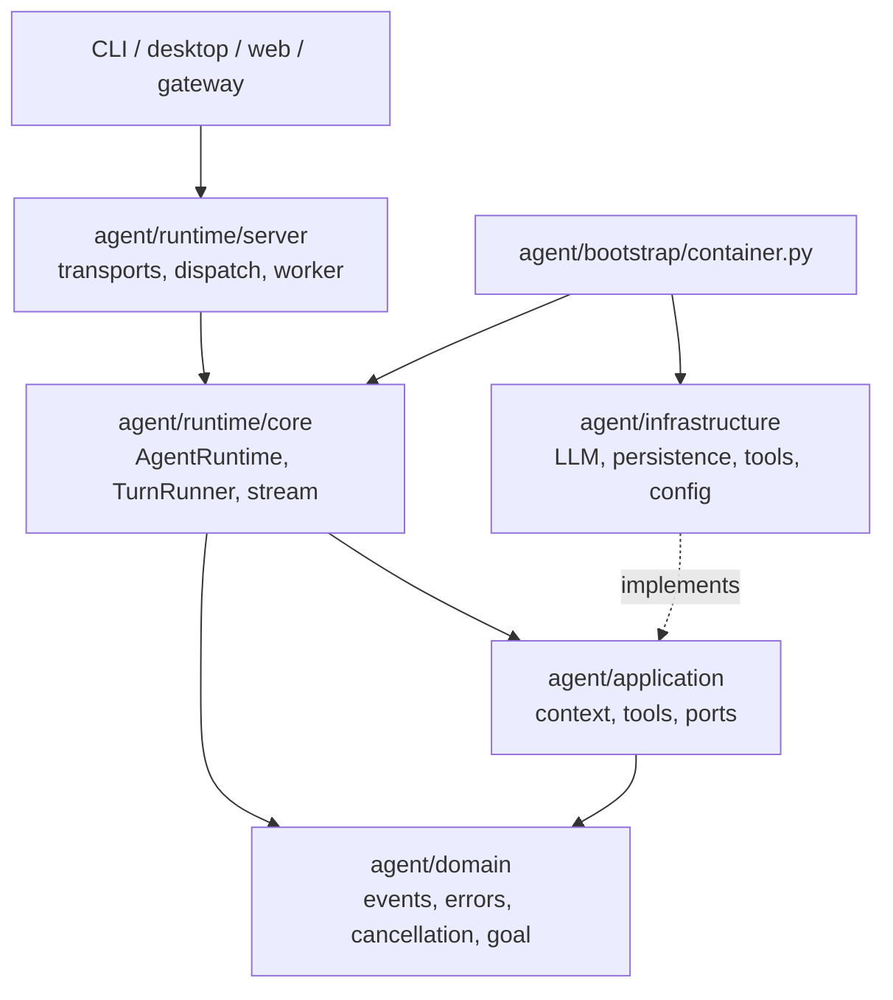
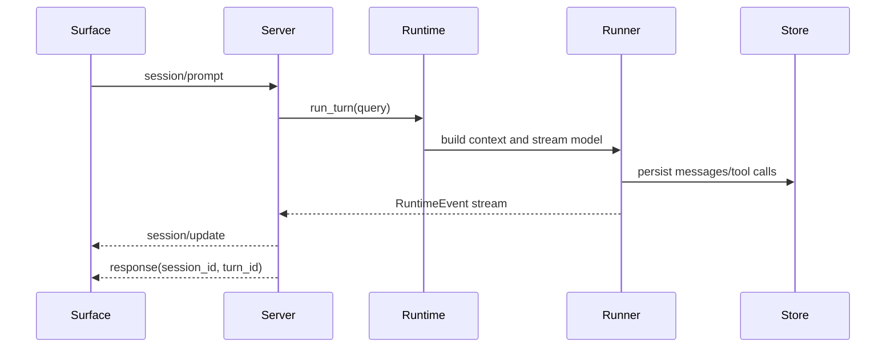

# Rind Current Code Architecture

Rind shares one Python Runtime Package across `frontend-cli`, `desktop`, `frontend-web`, and gateway integrations. Python serves the runtime protocol; interaction and rendering belong to the clients.

## Layering



- `domain` holds only domain models and standard-library logic.
- `application` orchestrates context, tools, skills, and ports; it depends on no concrete provider or surface.
- `runtime/core` is the execution core: it owns turn lifecycles, input queues, and the event stream.
- `runtime/server` is the unified Server facade: protocol dispatch, capability declaration, session/model/goal/background control, and the reusable command catalog.
- `infrastructure` implements the LLM, the JSONL session store, tool registration, config, and workspace integration.
- `bootstrap` is the only production composition root; the Server obtains its dependencies through `build_agent_container()`.

`runtime/core` imports neither `runtime/server`, `bootstrap`, nor concrete infrastructure. The server calls core in the same process. `prompts.py` is the single prompt entry and receives environment text explicitly; `infrastructure/environment.py` probes the host. The container injects workspace image promotion into the runner. Team delegation receives its session runner explicitly and does not import bootstrap.

## Runtime Package

```text
agent/runtime/
├── __init__.py
├── core/
│   ├── runtime.py          # AgentRuntime facade, turn lock, input queues, session control
│   ├── turn_runner.py      # context -> model -> tool main loop
│   ├── stream_parser.py    # provider stream parsing
│   └── stream_pump.py      # stream -> RuntimeEvent
└── server/
    ├── app_server.py       # startup arguments and worker creation
    ├── protocol.py         # v2 methods, capabilities, envelope, errors
    ├── dispatcher.py       # shared requests, subscriptions, responses
    ├── stdio.py            # JSONL stdin/stdout transport
    ├── websocket.py        # WebSocket transport and authentication
    ├── worker.py           # worker resources and lifecycle
    ├── session_service.py  # session access and startup draft
    ├── execution.py        # active tasks, inputs and execution release
    ├── workspace_files.py  # client file operations
    ├── replay_events.py    # durable event projection
    ├── resume_preview.py   # session resume summary
    └── commands/            # command catalog and runtime-safe handlers
```

## Surface protocol

`RuntimeWorker` starts one background model catalog refresh on its first initialization
and cancels and joins it at shutdown. Model list reads use only `model-cache.json`;
each provider entry stores `models`, `refreshed_at` (Unix seconds of the last successful
refresh), and `base_url`. Entries expire after 24 hours and are hidden when their
endpoint differs. Legacy list entries remain readable but expire immediately.
Configured providers with a supported list API use a ten-second request deadline
without SDK retries. Failed or empty responses preserve the cache. Login and explicit
refresh use the same query path regardless of cache age; no periodic refresh runs.

The protocol is defined in `agent/runtime/server/protocol.py`, mirrored for the frontend in `frontend-cli/lib/runtime-protocol.js`, and the Desktop allowlist of methods derives from `desktop/src/preload/types.ts`. Common methods use standard semantics:

`initialize`, `shutdown`, `session/new`, `session/list`, `session/switch`, `session/replay`, `session/prompt`, `session/cancel`, `model/list`, `model/set`.

Product extensions use the `rind/` namespace and are gated by capability declaration: `rind/session/steer`, `rind/session/follow_up`, `rind/session/unsteer`, `rind/session/dequeue_follow_up`, `rind/session/compact`, `rind/command/execute`, `rind/user-question/respond`, `rind/goal/*`, `rind/background/*`. The two kinds of queued input each deliver FIFO; without an `input_id` the retrieval methods each fetch the newest item (LIFO), and with an `input_id` they can remove any specific not-yet-delivered item from the corresponding kind.

Events are uniformly envelopes with `method: "session/update"` carrying `sequence`, `durability`, session/turn ids, and `event.type`. Incremental events can be consumed live; durable events serve recovery and state synchronization. The public fixture lives at `test/fixtures/runtime_protocol.golden.jsonl`.

## Main data flow



Control requests duplicate no business logic: the Server calls the Runtime's `set_model`, `switch_session`, `compact_context`, goal APIs, and input queues; command handlers use the same runtime/session instances through `SlashCommandContext`.

The default startup session reserves a stable ID in memory. Status, replay, login, and model selection do not create its session directory; the first user task or explicit goal writes it under the same ID. A draft cannot be resumed by another worker before that write. Explicit `session/new` requests still persist immediately, preserving gateway routing across worker restarts. SessionService retains only the startup draft store, and execution receives that store through the composition root.

## Entry points

```text
frontend-cli/bin/rind.js
  -> frontend-cli/lib/runtime-client.js
     -> python main.py app-server --stdio
        -> agent/runtime/server/app_server.py
           -> stdio.py -> dispatcher.py -> worker.py
              -> execution.py -> agent/bootstrap/container.py

desktop/src/main/index.ts
  -> desktop/src/main/runtime.ts
     -> python main.py app-server --stdio
```

The `desktop` main process isolates the worker, IPC, and project state; the renderer reaches the runtime only through the preload API. `frontend-cli` owns TTY/non-TTY input, menus, and text/Markdown rendering. Both consume the same methods, events, and capabilities. The CLI's TTY rendering uses a single component tree plus full-buffer diff architecture — see [`docs/cli-rendering.md`](cli-rendering.md).

## Test boundaries

- Python tests cover `runtime/core`, `runtime/server`, application/infrastructure, and the protocol fixtures.
- `frontend-cli/test` covers the protocol, controllers, input state, and rendering.
- `desktop/scripts` covers the fake runtime lifecycle, project/session adapters, and an app-server smoke test; Node 22+ is required to run the TypeScript source tests directly.
- `frontend-web/src` tests cover browser state and protocol adapters.
- `test/manual` contains explicitly requested user-scenario acceptance, isolated from default commands and CI.
