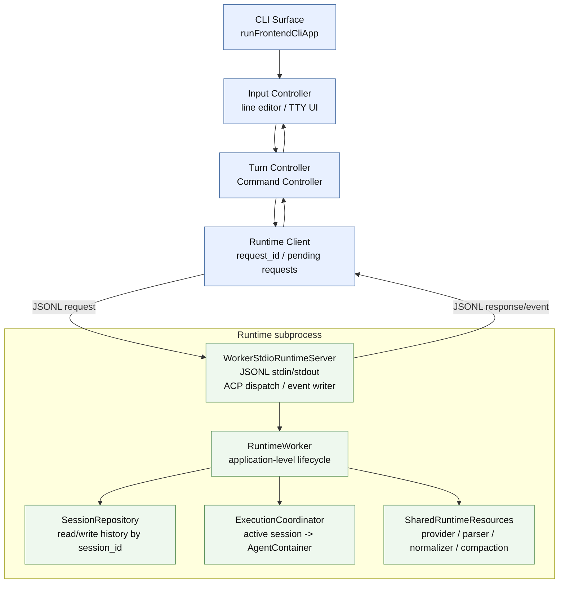
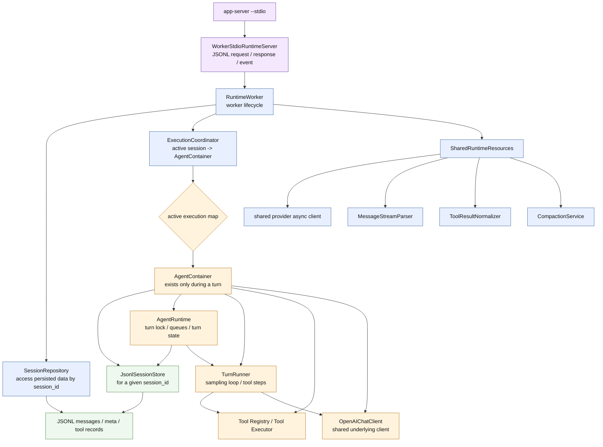
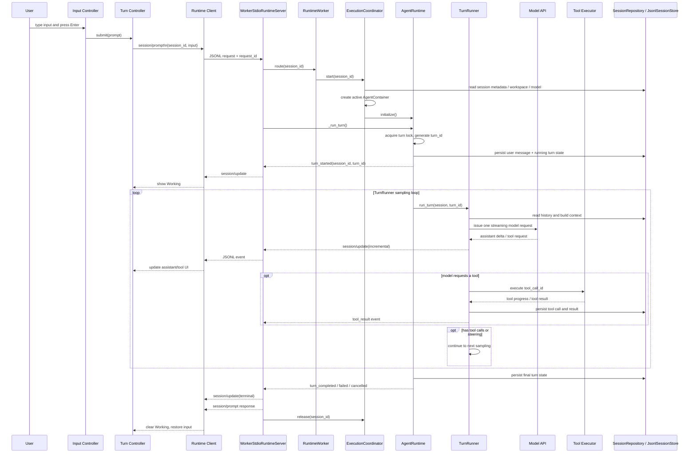
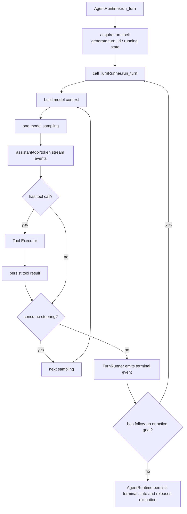
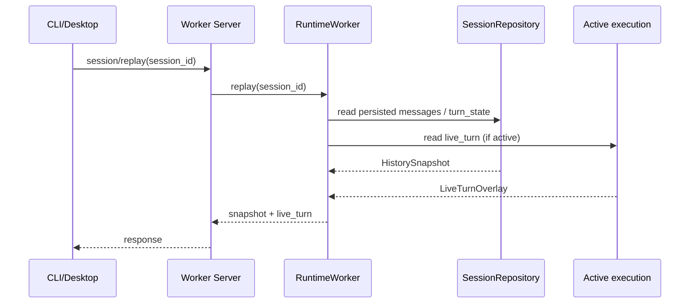
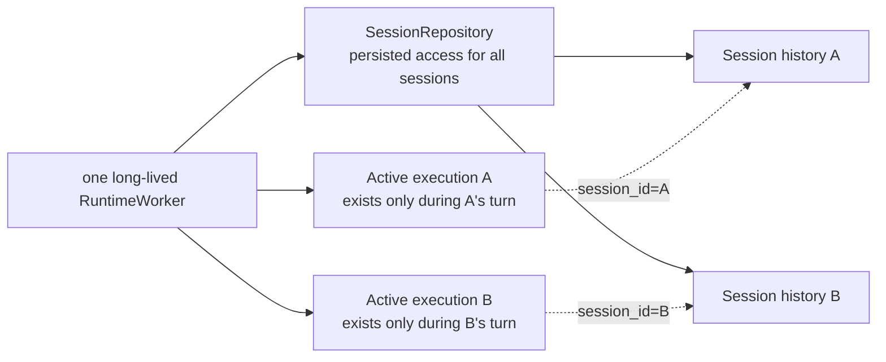
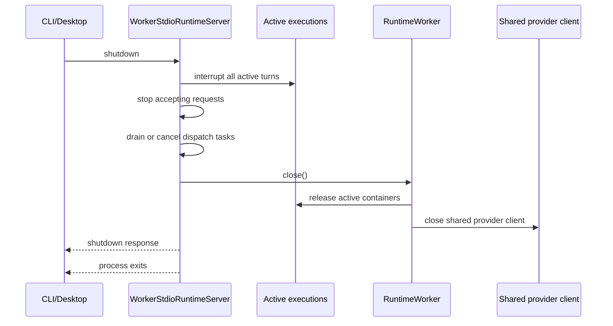

# How One CLI Turn Runs

This document describes the actual structure of the current Rind CLI and Runtime Worker. The CLI process spawns a long-lived Runtime subprocess; the worker routes requests by `session_id`. Historical sessions are never cached as long-lived runtime objects — an active execution is created only when a turn actually runs.

Current lifecycle boundaries:

```text
Worker process is long-lived
├── WorkerStdioRuntimeServer: JSONL ACP transport, routing, event wrapping
├── RuntimeWorker: owner of worker-level resources and services
│   ├── SessionRepository: reads/writes persisted history by session_id
│   ├── ExecutionCoordinator: holds only active executions
│   └── SharedRuntimeResources: provider client, parser, normalizer, compaction service
└── active execution
    └── AgentContainer(session store + AgentRuntime + TurnRunner + tools)
```

`SessionRepository` only handles persisted access; it never creates an `AgentRuntime` just to browse history. `ExecutionCoordinator` holds the matching `AgentContainer` only while a turn runs and releases it at the turn's terminal state.

## Component structure



CLI and Runtime are two processes; `WorkerStdioRuntimeServer`, `RuntimeWorker`, `SessionRepository`, and `ExecutionCoordinator` all live inside the same Runtime subprocess. Desktop reuses the same worker ACP boundary but can observe multiple sessions at once; the CLI usually shows only the current session.

## Worker internals

The diagram below shows the worker's long-lived objects after startup, the read-only path, and the active-turn path. `AgentContainer` exists only inside an active execution and is not part of a session's long-lived state.



### Worker responsibilities

- `WorkerStdioRuntimeServer`: validates ACP requests, routes by `session_id`, manages active server wrappers, and sends responses and `session/update` events.
- `RuntimeWorker`: creates the shared provider client, repository, and execution coordinator; owns worker initialization and shutdown.
- `SessionRepository`: reads persisted state such as metadata, session lists, replay, goals, and models; read-only replay creates no execution objects.
- `ExecutionCoordinator`: creates an `AgentContainer` once a request that needs execution (prompt/compact and the like) arrives; releases it at the turn's terminal state.
- `SharedRuntimeResources`: holds the provider client, stream parser, result normalizer, and compaction service, none of which carry per-session mutable state.
- `AgentRuntime`: the active turn owner; owns the turn lock, turn_id, steering/follow-up, question waiting, persisted turn state, and the terminal state.
- `TurnRunner`: runs the turn's model sampling, stream parsing, tool calls, and step resumption; one turn can contain multiple samplings.
- `Tool Executor`: executes tools and produces results keyed by `tool_call_id`; not a separate process.

## Startup sequence

```mermaid
sequenceDiagram
    participant C as CLI
    participant P as Runtime subprocess
    participant S as WorkerStdioRuntimeServer
    participant W as RuntimeWorker
    participant R as SessionRepository
    participant E as ExecutionCoordinator

    C->>C: read local settings / CLI args
    C->>P: spawn app-server --stdio
    P->>S: create WorkerStdioRuntimeServer
    S->>W: create RuntimeWorker
    W->>W: create shared provider client and SharedRuntimeResources
    W->>R: create SessionRepository
    W->>E: create empty ExecutionCoordinator
    C->>S: initialize(request_id)
    S->>W: initialize()
    W->>R: initial(workspace, session_id, resume_latest)
    R-->>W: session metadata
    S-->>C: initialize response(session_id, model, methods, commands)
    Note over C,E: Worker is resident; no active AgentContainer exists yet
```

Initialization only reads or creates session metadata. Opening a historical session, running `session/replay`, or switching the CLI's current session never creates an `AgentContainer`.

## An ordinary turn

Suppose the user enters "investigate why the tests failed".



The `session/prompt` response and the `turn_completed` event are two distinct outputs: the event drives live rendering, and the response closes the request. The CLI must not print both as new assistant content.

## Turn inner loop



A tool result does not end the turn by itself; it goes into history and the next model context. One turn can run multiple samplings but uses a single `turn_id`. Only after AgentRuntime confirms there is no follow-up, active goal continuation, or unfinished control state does it emit the terminal state and release the active execution.

## History replay and the active turn

`session/replay` is a read-only ACP request:

```text
WorkerStdioRuntimeServer
  -> RuntimeWorker.replay(session_id)
  -> SessionRepository.replay(session_id)
  -> messages + turn_state
  -> if the session has an active execution, also attach live_turn
```

`live_turn` is a bounded snapshot in worker memory used only so a surface switching back to a session can restore the not-yet-persisted assistant tail, tool state, question, plan, and pending input. It never writes to history or starts a new execution.



Switching sessions on a surface sends no new prompt, does not automatically send `resume=true`, and does not re-execute tools. While the worker is still alive, returning to the view keeps receiving events for the same `session_id` and `turn_id`; once the worker has exited, only the persisted history can be restored.

## Steering, queues, and event delivery

Ordinary input:

```text
idle session -> session/prompt
active turn -> rind/session/steer or rind/session/follow_up
```

Input acceptance and actual delivery are two stages:

```text
rind/session/steer / rind/session/follow_up
  -> response(input_id, pending)
  -> turn loop consumes it at step boundaries
  -> session/update(event.type = queued_input_delivered)
```

`input_id` is the queued entity's identity; only `queued_input_delivered` means the input actually entered the turn. Neither the CLI nor Desktop should treat an "accepted/pending" response as a delivered message.

## Multiple turns and multiple sessions



- Multi-turn conversations: a session's history is persisted by the repository; each new turn creates a new `AgentContainer` and a new `turn_id`, with no reliance on the previous turn's resident runtime objects.
- Multiple sessions: one worker can hold active executions A and B at the same time; they share worker-level stateless resources such as provider/parser, but each owns its session store, turn lock, queues, and AgentRuntime state.
- CLI session switching: `/sessions` fetches the list via `rind/command/execute`, then `session/switch` fetches the target's metadata; switching neither restarts the worker nor creates an execution.
- Desktop session switching: uses the local sidebar index and `session/replay`; it does not call `session/switch`.
- Cancelling A: calls `session/cancel` for A only and does not affect B.

## Shutdown sequence



History files are not deleted by execution release or a normal shutdown; only the existing empty-session cleanup rules handle empty records.
