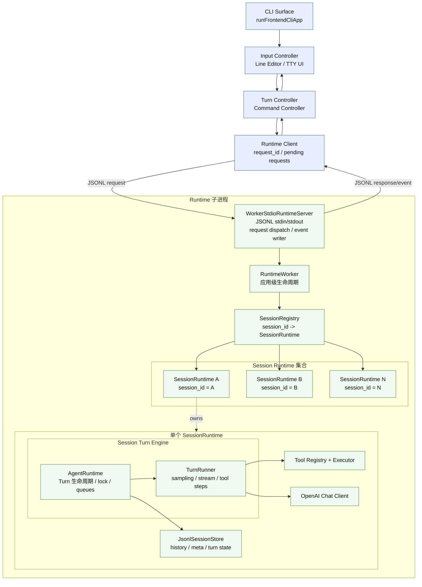
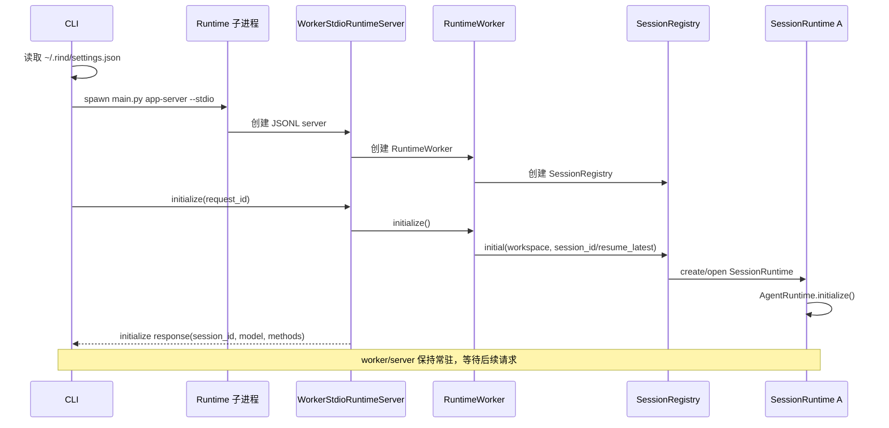
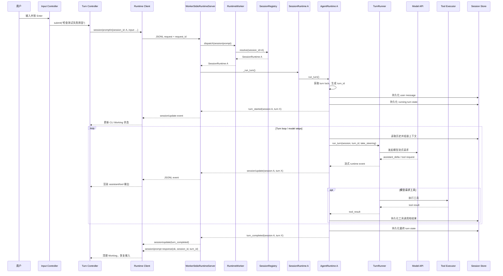
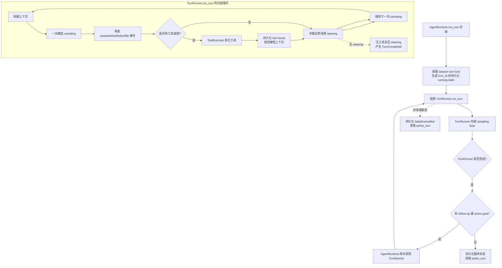
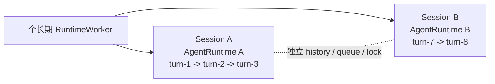
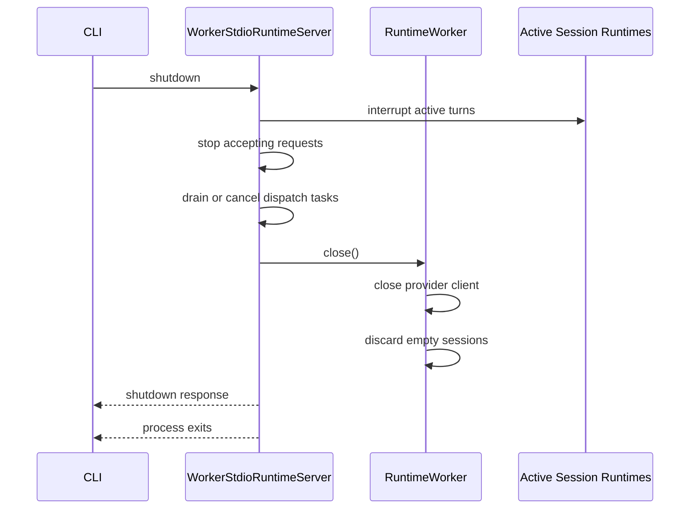

# CLI 一次 Turn 的运行流程

本文描述当前 CLI 端的实际运行结构。当前实现采用一个 CLI 进程启动一个长期运行的 Runtime worker；worker 内部按 `session_id` 路由请求，每个 session 持有独立的 `AgentRuntime`、turn lock、队列和历史存储。

`SessionRuntime` 是 worker 内缓存的 session 容器。它在 session 被打开后保留在 `SessionRegistry` 中，但没有 active turn 时不会自行运行；只有收到 prompt 或控制请求时，才调用其中的 `AgentRuntime`。

## 组件结构



图中的 `SessionRuntime A/B/N` 是同一 worker 管理的多个 session。当前实现中，每个 session 的 `AgentContainer` 内包含自己的 `AgentRuntime` 和 `TurnRunner`；同一 session 的多次对话复用这些对象，但每一轮拥有新的 `turn_id`。

这些组件都位于同一个 Runtime 子进程中，不是多个子进程：

```text
Runtime 子进程
├── WorkerStdioRuntimeServer 传输和请求路由
└── RuntimeWorker 应用级生命周期
    └── SessionRegistry
        └── SessionRuntime（按 session_id 缓存）
```

## 启动时序



## 一个普通 Turn

假设用户输入 `检查测试失败原因`。



## SessionRuntime、AgentRuntime 和 TurnRunner

三者的关系是：

```text
SessionRuntime
└── AgentContainer
    ├── AgentRuntime：session 级 turn 生命周期、锁和队列
    ├── TurnRunner：一次模型/工具执行步骤
    ├── ToolExecutor：执行具体工具
    └── SessionStore：历史、meta 和 turn state
```

`AgentRuntime` 和 `TurnRunner` 共同组成一个 session 的 `Session Turn Engine`。`AgentRuntime` 是外层 owner，负责锁、turn 状态、用户输入持久化、终态持久化以及 follow-up/goal continuation；`TurnRunner.run_turn()` 是其中的 sampling/工具执行器，自身包含模型 sampling 的内部循环。因此，当前代码不是“一个 TurnRunner 对象只执行一次 sampling”，而是“一个 Turn Engine 管理完整 Turn，其中 TurnRunner 内部可能执行多次 sampling”。`ToolExecutor` 是 `TurnRunner` 的依赖对象，不是独立进程。

## Turn 内部循环

`AgentRuntime.run_turn()` 和 `TurnRunner.run_turn()` 是两层循环：



工具执行完成后不会直接结束 turn。工具结果会先被持久化，并重新放入模型上下文，由 `TurnRunner` 发起下一次 sampling。只有 `TurnRunner` 内部确认没有工具调用和 steering 后，才产生该执行段的 `TurnCompleted`；随后 `AgentRuntime` 还会检查 follow-up 或 active goal continuation。只有两者都没有时，才会持久化整个 turn 的最终状态并清理 `active_turn`。

这里的“多次模型请求”仍属于同一个 turn；只有 turn 结束后，下一次用户输入才会创建新的 `turn_id`。

## Steering、Queue 和事件回传

普通输入在没有 active turn 时调用：

```text
session/prompt
```

active turn 期间，CLI 的 steer 请求调用：

```text
rind/session/steer
```

请求必须携带当前 `session_id` 和 `turn_id`。worker 校验通过后返回 `input_id` 和 `pending`，但这只代表输入已进入队列。

真正被 turn loop 消费时，worker 发出：

```text
queued_input_delivered
```

CLI 以该事件作为“已出队、已交给 turn loop”的权威依据。follow-up queue 使用 `rind/session/follow_up`，在当前模型步骤完成后进入下一步。

## 多轮与多 Session



- 多轮对话：复用同一个 session 的 `AgentRuntime` 和 `TurnRunner`，每次重新进入 `run_turn()`，生成新的 `turn_id`。
- 多 session：由同一个 worker 管理，但通过不同 `session_id` 找到不同的 `SessionRuntime`。CLI 同一时刻只有一个当前 session；多个 session 是底层 Registry 的管理能力，主要用于 `/sessions` 切换和复用，Desktop 才会同时展示多个 session。
- session 切换：CLI 更新当前 `session_id`；不会重新启动 worker。
- turn 取消：调用 `session/cancel`，并携带当前 `turn_id`；不会影响其他 session。

## 退出流程


