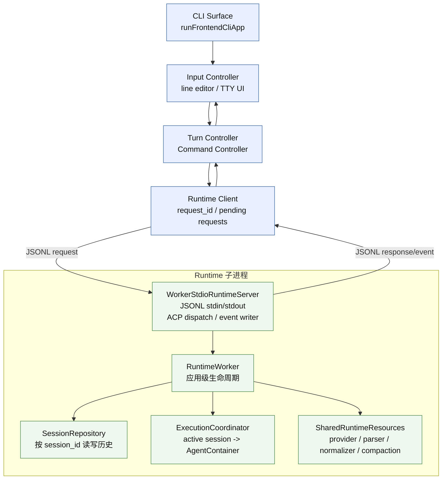
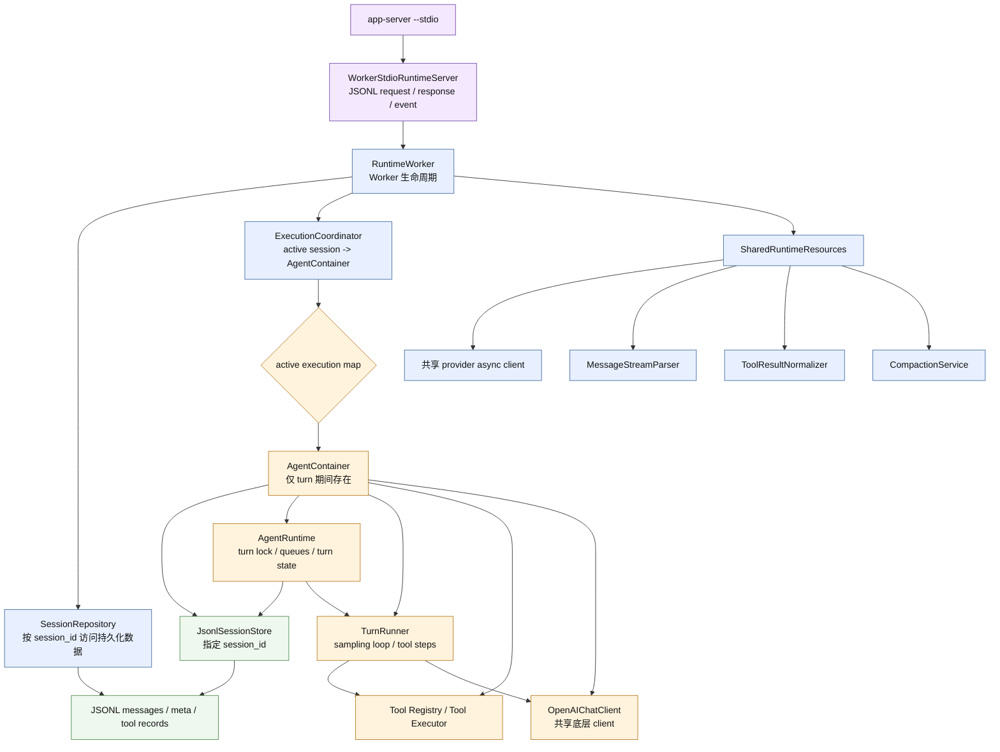
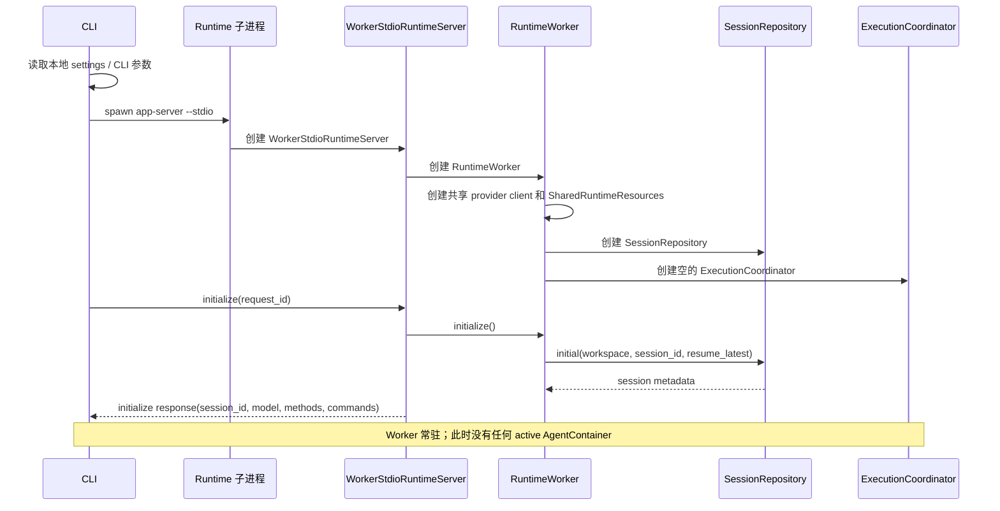
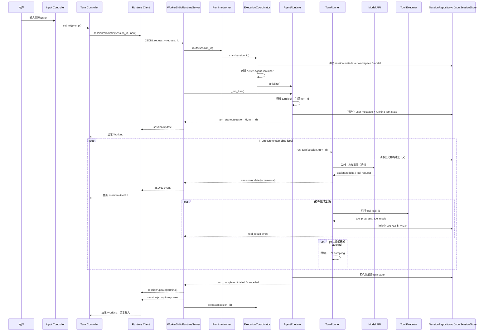
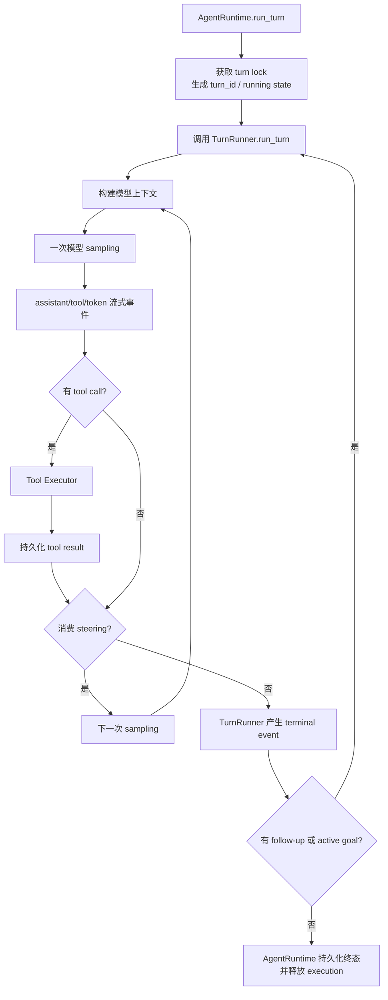
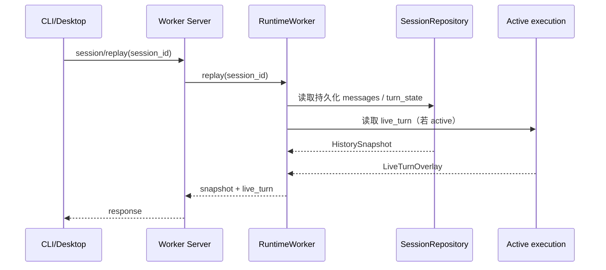
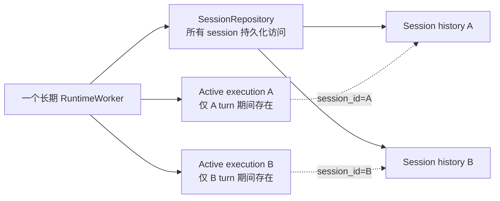
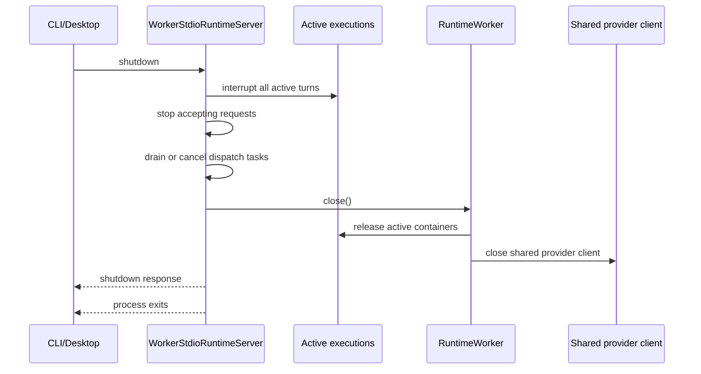

# CLI 一次 Turn 的运行流程

本文描述当前 Rind CLI 与 Runtime Worker 的实际结构。CLI 进程启动一个长期运行的 Runtime 子进程；Worker 按 `session_id` 路由请求。历史 session 不会被 Worker 长期缓存成运行对象，只有真正执行 turn 时才创建 active execution。

当前生命周期边界：

```text
Worker 进程长期运行
├── WorkerStdioRuntimeServer：JSONL ACP 传输、路由、事件封装
├── RuntimeWorker：Worker 级资源和服务所有者
│   ├── SessionRepository：按 session_id 读写持久化历史
│   ├── ExecutionCoordinator：只保存 active execution
│   └── SharedRuntimeResources：provider client、parser、normalizer、compaction service
└── active execution
    └── AgentContainer(session store + AgentRuntime + TurnRunner + tools)
```

`SessionRepository` 只负责持久化访问，不会为浏览历史创建 `AgentRuntime`。`ExecutionCoordinator` 只在 turn 运行期间保存对应的 `AgentContainer`，turn 终态后释放。

## 组件结构



CLI 和 Runtime 是两个进程；`WorkerStdioRuntimeServer`、`RuntimeWorker`、`SessionRepository` 和 `ExecutionCoordinator` 都在同一个 Runtime 子进程内。Desktop 复用同一 Worker ACP 边界，但可以同时观察多个 session；CLI 通常只展示当前 session。

## Worker 内部构造

下面的图展示 Worker 启动后的长期对象、只读路径和 active turn 路径。`AgentContainer` 只位于 active execution 中，不属于 session 的长期缓存。



### Worker 内部职责

- `WorkerStdioRuntimeServer`：校验 ACP 请求、按 `session_id` 路由、管理 active server wrapper、发送 response 和 `session/update` event。
- `RuntimeWorker`：创建共享 provider client、repository 和 execution coordinator；负责 Worker 初始化与关闭。
- `SessionRepository`：读取 metadata、session list、replay、goal 和 model 等持久化状态；只读 replay 不创建执行对象。
- `ExecutionCoordinator`：在 prompt/compact 等需要执行的请求到达后创建 `AgentContainer`；turn 终态后释放。
- `SharedRuntimeResources`：保存无 session 可变状态的 provider client、stream parser、result normalizer 和 compaction service。
- `AgentRuntime`：active turn owner，负责 turn lock、turn_id、steering/follow-up、问题等待、持久化 turn 状态和终态。
- `TurnRunner`：执行 turn 内模型 sampling、流式解析、工具调用和步骤恢复；一次 turn 可以包含多次 sampling。
- `Tool Executor`：执行工具并按 `tool_call_id` 产生结果；不是独立进程。

## 启动时序



初始化只读取或创建 session metadata。打开历史 session、执行 `session/replay` 或切换 CLI 当前 session 都不会创建 `AgentContainer`。

## 一个普通 Turn

假设用户输入“检查测试失败原因”。



`session/prompt` response 和 `turn_completed` event 是两条不同的输出：event 用于实时渲染，response 用于结束本次请求。CLI 不应把二者都当作新的 assistant 内容打印。

## Turn 内部循环



工具结果不会直接结束 turn；结果进入历史和下一次模型上下文。一个 turn 可以进行多次 sampling，但只使用一个 `turn_id`。只有 AgentRuntime 确认没有 follow-up、active goal continuation 或未完成控制状态后，才发送终态并释放 active execution。

## 历史 replay 与活动 turn

`session/replay` 是只读 ACP 请求：

```text
WorkerStdioRuntimeServer
  -> RuntimeWorker.replay(session_id)
  -> SessionRepository.replay(session_id)
  -> messages + turn_state
  -> 若该 session 有 active execution，再附加 live_turn
```

`live_turn` 是 Worker 内存中的有界快照，只用于 surface 在切换 session 时恢复未落盘的 assistant 尾部、tool 状态、question、plan 和 pending input。它不写入历史，不启动新的 execution。



surface 切换 session 不发送新的 prompt，不自动发送 `resume=true`，也不重复执行工具。Worker 仍存活时，切回页面可以继续接收同一 `session_id`、`turn_id` 的事件；Worker 已退出时只能恢复已持久化历史。

## Steering、Queue 与事件回传

普通输入：

```text
空闲 session -> session/prompt
active turn -> rind/session/steer 或 rind/session/follow_up
```

输入接纳和真正交付是两个阶段：

```text
rind/session/steer / rind/session/follow_up
  -> response(input_id, pending)
  -> turn loop 在步骤边界消费
  -> session/update(event.type = queued_input_delivered)
```

`input_id` 是队列实体身份；`queued_input_delivered` 才表示输入真正进入 turn。CLI 和 Desktop 都不应在收到“accepted/pending” response 时把它当作已交付消息。

## 多轮与多 Session



- 多轮对话：同一 session 的历史被 repository 持久化；每个新 turn 创建新的 `AgentContainer` 和新的 `turn_id`，不依赖上一个 turn 的常驻运行对象。
- 多 session：同一个 Worker 可以同时拥有 A、B 两个 active execution；它们共享 Worker 级 provider/parser 等无状态资源，但各自拥有 session store、turn lock、queue 和 AgentRuntime 状态。
- CLI session 切换：`/sessions` 通过 `rind/command/execute` 获取列表，再调用 `session/switch` 获取目标 metadata；切换不会重启 Worker，也不会创建 execution。
- Desktop session 切换：使用本地侧栏索引和 `session/replay`；不调用 `session/switch`。
- 取消 A：只调用带 A 的 `session/cancel`，不影响 B。

## 退出流程



历史文件不会因为 execution release 或正常 shutdown 被删除；只有已有的空 session 清理规则才会处理空记录。
