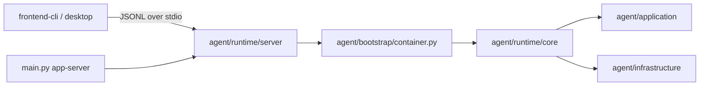
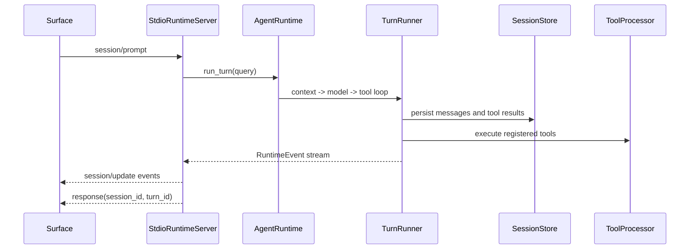

# Rind 主流程与运行时数据流

本文描述当前两个产品入口如何共享 Runtime Package。`frontend-cli` 和 Desktop 都是 Surface；Python 入口只负责启动无头 Runtime Server。

## 1. 入口与组合根



`main.py --version` 和 `main.py --help` 只提供 Runtime Package 的元信息；实际运行命令是：

```bash
python main.py app-server --stdio --cwd <workspace>
```

`agent/runtime/server/app_server.py` 校验工作区、加载共享 settings、调用 `build_agent_container()`，然后把 runtime 和 session store 交给 `StdioRuntimeServer`。Server 和 core 位于同一个 Runtime Package 内，不存在 server 到 runtime 的额外 RPC。

## 2. Surface 启动

### frontend-cli

`frontend-cli/bin/rind.js` 创建 `runtime-client`，源代码模式启动 `python main.py app-server --stdio`，安装包模式启动 `rind-runtime`。Node 进程负责输入编辑、菜单、状态和文本渲染；Python 进程只负责协议与 Agent 执行。

### Desktop

Electron 主进程的 `desktop/src/main/runtime.ts` 为每个工作区维护一个 Runtime worker，IPC 只允许 `desktop/src/preload/types.ts` 中声明的方法。Renderer 通过 preload 调用统一请求接口，不直接访问 Python 或 session 文件。

## 3. JSONL 协议

请求和响应使用 `request_id` 匹配；事件是独立消息，不占用响应通道。所有请求携带 `kind: "request"`：

```json
{"kind":"request","request_id":1,"method":"session/prompt","params":{"input":"inspect the project"}}
```

初始化返回 `protocol_version`、`capabilities`、`methods`、当前 session 和可用 `commands`。核心方法包括：

| 方法 | 作用 |
| --- | --- |
| `initialize`, `shutdown` | 生命周期 |
| `session/new`, `session/list`, `session/switch`, `session/replay` | session 管理 |
| `session/prompt`, `session/cancel` | turn 输入与取消 |
| `model/list`, `model/set` | 模型能力 |
| `session/update` | 统一事件通知 |

Rind 扩展使用明确的 `rind/` 命名空间，例如 `rind/session/steer`、`rind/session/follow_up`、`rind/session/compact`、`rind/command/execute`、`rind/goal/*` 和 `rind/background/*`。只有在初始化能力声明中出现的扩展才可调用。

事件 envelope 的公共字段是 `kind`、`method: "session/update"`、单调递增 `sequence`、`durability`、`session_id`、`turn_id` 和嵌套的 domain event。事件类型位于 `event.type`，不再重复放在外层。

## 4. 一次 prompt



`session/cancel` 取消当前 token；`rind/session/steer` 和 `rind/session/follow_up` 分别进入当前 turn 的控制队列和后续 turn 队列。两类队列按 FIFO 投递；`rind/session/unsteer` 与 `rind/session/dequeue_follow_up` 不带 `input_id` 时分别以 LIFO 取回最新输入，带 `input_id` 时按 ID 取回指定输入。`rind/session/compact`、模型、session、goal 和 background 请求不绕过 Server 直接触碰 core。

## 5. 代码阅读顺序

```text
main.py
  -> agent/runtime/server/app_server.py
     -> agent/bootstrap/container.py
        -> agent/runtime/core/runtime.py
           -> agent/runtime/core/turn_runner.py
              -> agent/application/context/*
              -> agent/application/tools/*
              -> agent/infrastructure/*

Surface clients:
  frontend-cli/lib/runtime-protocol.js
  frontend-cli/lib/runtime-client.js
  frontend-cli/lib/*-controller.js
  desktop/src/main/runtime.ts
  desktop/src/renderer/index.ts
```
