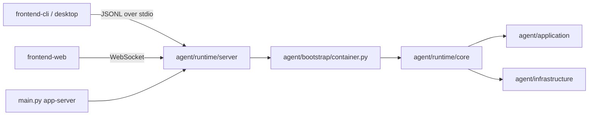
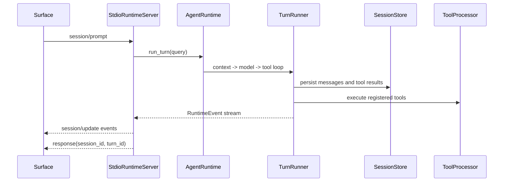

# Rind Main Flow and Runtime Data Flow

This document describes how the two current product entry points share the Runtime Package. `frontend-cli` and Desktop are both surfaces; the Python entry point only starts the headless Runtime Server.

## 1. Entry points and composition root



`main.py --version` and `main.py --help` only report Runtime Package metadata; the actual run command is:

```bash
python main.py app-server --stdio --cwd <workspace>
```

For a long-lived remote worker, start the WebSocket transport instead:

```bash
python main.py app-server --web --host 127.0.0.1 --port 8765 --cwd <workspace>
```

`agent/runtime/server/app_server.py` validates the workspace, loads shared settings, calls `build_agent_container()`, and hands the runtime and session store to `StdioRuntimeServer`. Server and core live in the same Runtime Package; there is no extra RPC from server to runtime.

## 2. Surface startup

### frontend-cli

`frontend-cli/bin/rind.js` creates the `runtime-client`; source mode spawns `python main.py app-server --stdio`, installed-package mode spawns `rind-runtime`. `frontend-web` connects to the WebSocket worker exposed by `--web`; a browser disconnecting does not shut the worker down. The surface process owns input editing, menus, state, and text rendering; the Python process owns only the protocol and agent execution.

### Desktop

The Electron main process's `desktop/src/main/runtime.ts` keeps one Runtime worker per workspace, and IPC allows only the methods declared in `desktop/src/preload/types.ts`. The renderer calls the unified request interface through the preload and never touches the Python process or session files directly.

## 3. JSONL protocol

Requests and responses are matched by `request_id`; events are standalone messages that do not occupy the response channel. All requests carry `kind: "request"`:

```json
{"kind":"request","request_id":1,"method":"session/prompt","params":{"input":"inspect the project"}}
```

Initialization returns `protocol_version`, `capabilities`, `methods`, the current session, and available `commands`. Core methods:

| Method | Purpose |
| --- | --- |
| `initialize`, `shutdown` | Lifecycle |
| `session/new`, `session/list`, `session/switch`, `session/replay` | Session management |
| `session/prompt`, `session/cancel` | Turn input and cancellation |
| `model/list`, `model/set` | Model capabilities |
| `session/update` | Unified event notification |

Rind extensions use an explicit `rind/` namespace, for example `rind/session/steer`, `rind/session/follow_up`, `rind/session/compact`, `rind/command/execute`, `rind/goal/*`, and `rind/background/*`. Only extensions present in the initialization capability declaration may be called.

The public fields of an event envelope are `kind`, `method: "session/update"`, a monotonically increasing `sequence`, `durability`, `session_id`, `turn_id`, and the nested domain event. The event type lives at `event.type` and is no longer duplicated at the outer level.

## 4. One prompt



`session/cancel` cancels the current token; `rind/session/steer` and `rind/session/follow_up` enter the current turn's steering queue and the next-turn queue respectively. Both queues deliver FIFO; without an `input_id`, `rind/session/unsteer` and `rind/session/dequeue_follow_up` each retrieve the newest input LIFO, and with an `input_id` they retrieve the specified input by ID. `rind/session/compact`, model, session, goal, and background requests never bypass the Server to touch core directly.

## 5. Code reading order

```text
main.py
  -> agent/runtime/server/app_server.py
     -> agent/bootstrap/container.py
        -> agent/runtime/core/runtime.py
           -> agent/runtime/core/turn_runner.py
              -> agent/application/context/*
              -> agent/application/tools/*
              -> agent/infrastructure/*

Surface clients:
  frontend-cli/lib/runtime-protocol.js
  frontend-cli/lib/runtime-client.js
  frontend-cli/lib/*-controller.js
  desktop/src/main/runtime.ts
  desktop/src/renderer/index.ts
```
