# Rind 主流程与运行时数据流

> 本文描述当前实现从 CLI/API 启动、构建 runtime，到一次 turn、工具循环、持久化、取消和退出的完整路径。它与 `docs/architecture.md` 的关系是：architecture 说明静态结构，本文件说明时间顺序和状态变化。

## 1. 入口总览

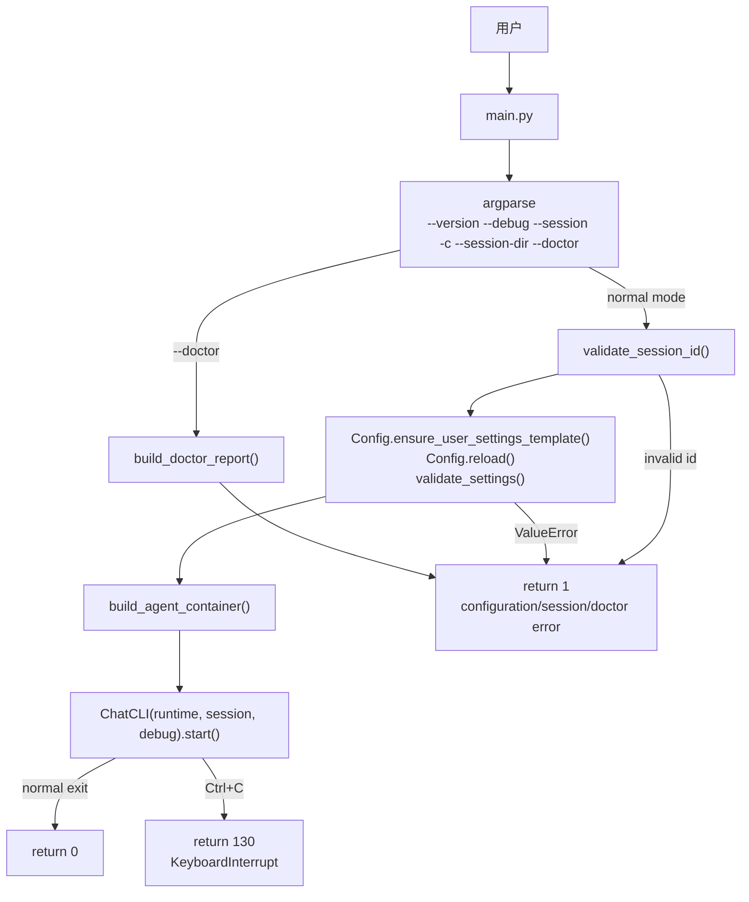

`--doctor` 在构建完整 Agent 之前执行诊断并退出；普通启动才会初始化 settings、构建 container 和 CLI。`main.py` 当前直接把 `container.runtime` 与 `container.session_store` 传给 `ChatCLI`。

## 2. frontend-cli / ts_cli 启动全流程

仓库没有单独的 `ts_cli` 实现；当前对应的终端入口是 `frontend-cli/bin/rind.js`。它与 `python main.py` 是两条不同的启动路径：前者负责 Node 终端体验，后者负责 Python CLI；`frontend-cli` 的交互模式通过 stdio runtime 子进程复用 Python 应用核心。

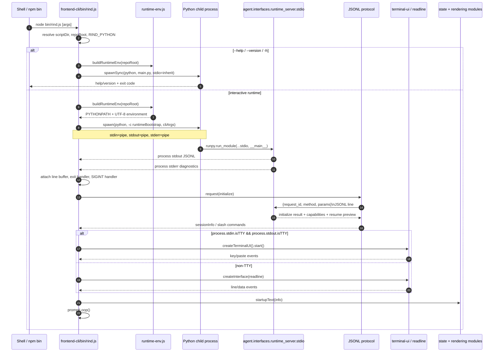

### 2.1 Python child 的启动细节

`rind.js` 不执行 `python main.py` 进入交互模式，而是构造一段 `runtimeBootstrap`：

```python
import os, runpy, sys
repo = os.path.abspath(REPO_ROOT)
cwd = os.path.abspath(os.getcwd())
blocked = {os.path.normcase(repo), os.path.normcase(cwd)}
sys.path = [repo] + [p for p in sys.path if p and os.path.normcase(os.path.abspath(p)) not in blocked]
runpy.run_module("agent.interfaces.runtime_server.stdio", run_name="__main__")
```

这样做的作用是：

- 以仓库根目录作为 Python import 根；
- 从 `sys.path` 中去掉可能遮蔽仓库模块的 repo/cwd 项；
- 直接启动 JSONL `StdioRuntimeServer`，不启动 Python `ChatCLI`；
- 将 Node 终端 UI 与 Python AgentRuntime 解耦。

### 2.2 stdio server 子进程启动

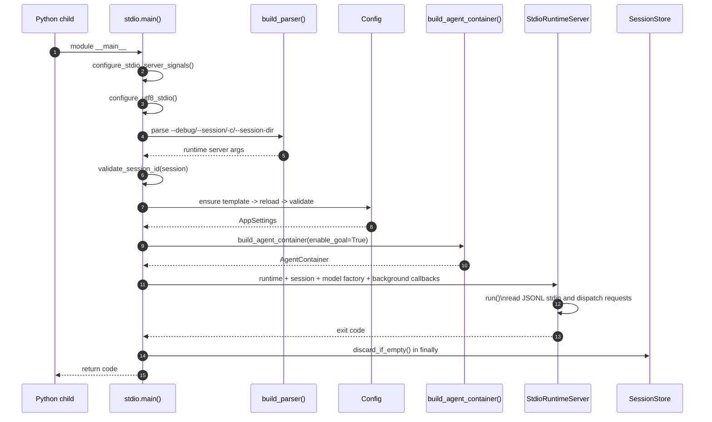

这一步与 Python `main.py` 的 CLI 启动不同：stdio server 不创建 `ChatCLI`，而是把 `container.runtime` 交给 `StdioRuntimeServer`；同时默认启用 goal 能力，并注册 background task list/output 回调。

### 2.3 stdio 管道和 request multiplex

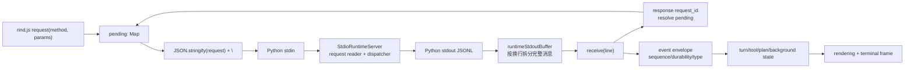

request response 与 event 共用 stdout；`request_id` 只用于匹配 response，event 通过 `event_type` 或 `event.type` 分发。Node 端必须保留未完整接收的尾行，防止一次 data chunk 恰好落在 JSONL 行中间。

### 2.4 frontend-cli 进入 prompt loop 后的状态

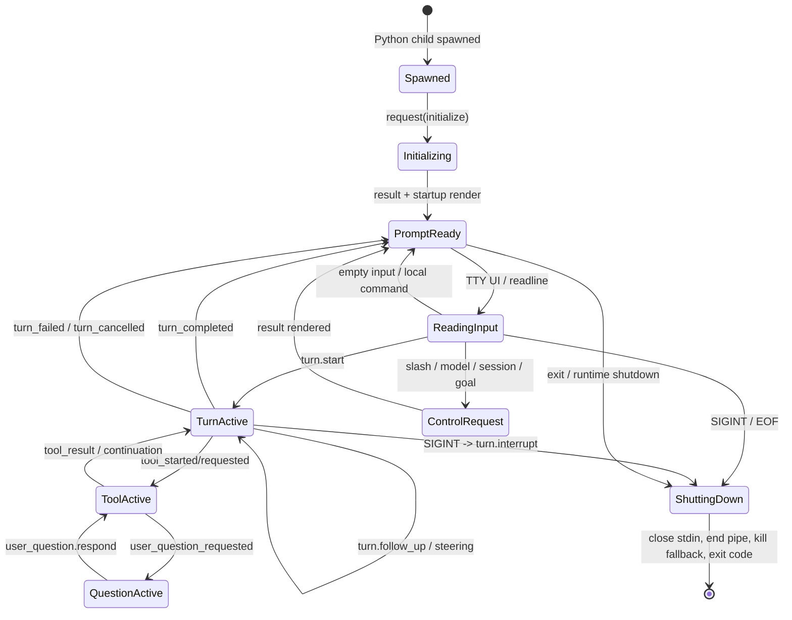

## 3. 启动与依赖组装顺序

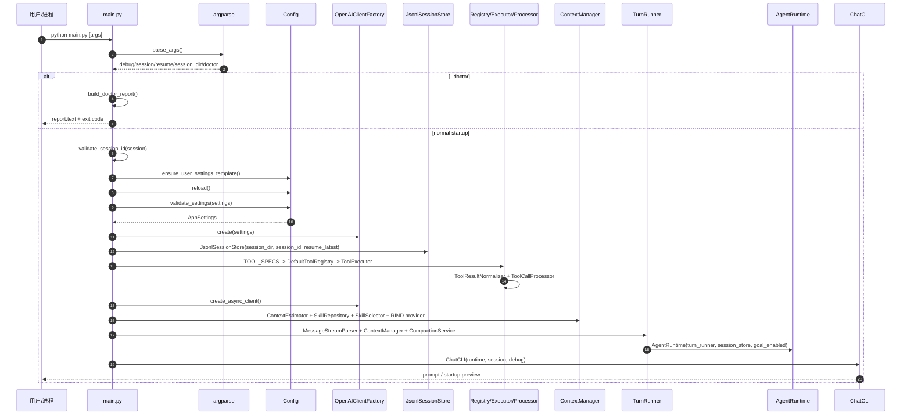

### Container 内的对象连接

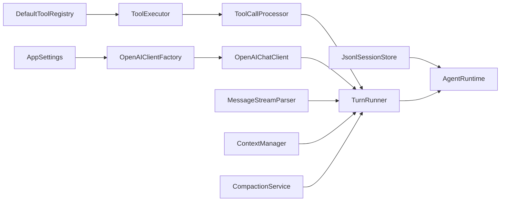

## 4. CLI 交互循环

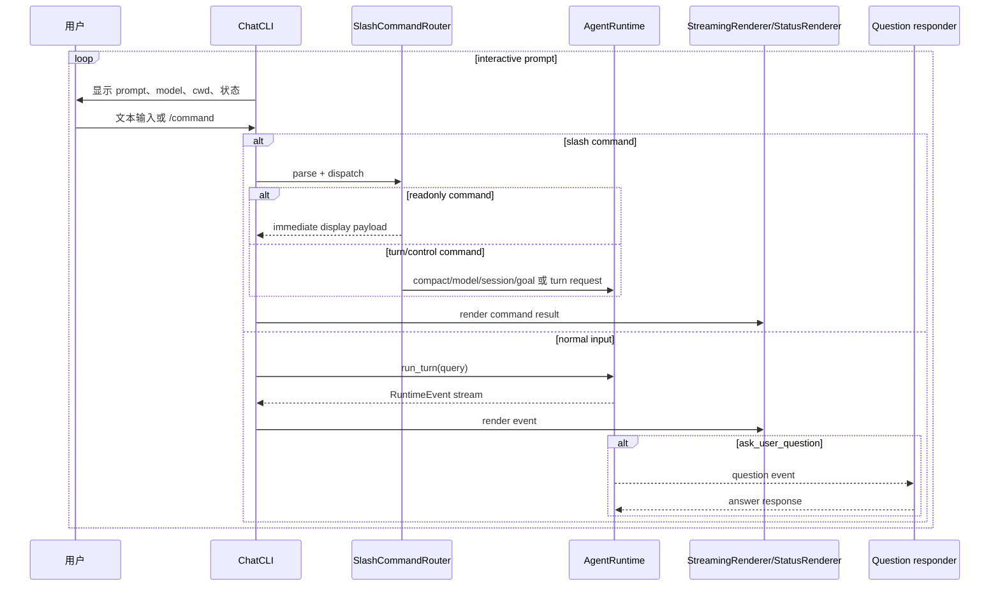

前端 `frontend-cli/bin/rind.js` 是另一条 CLI 外壳：它启动 Python stdio runtime 子进程，发送 JSONL request，使用 `runtime-protocol.js` 解析 envelope，并将事件交给输入状态、后台任务状态和 `rendering.js`。

## 5. 一次普通 turn 的完整时序

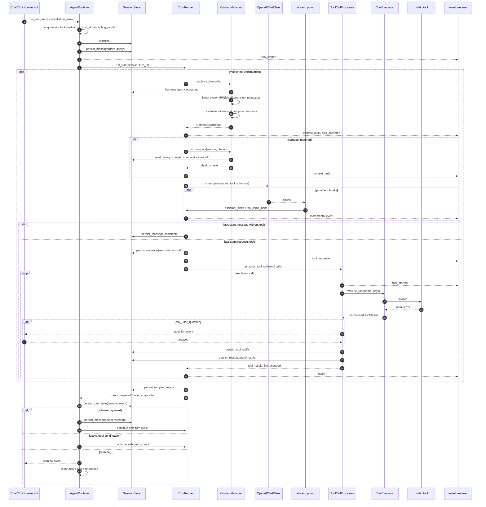

## 6. 上下文、compact 和错误恢复

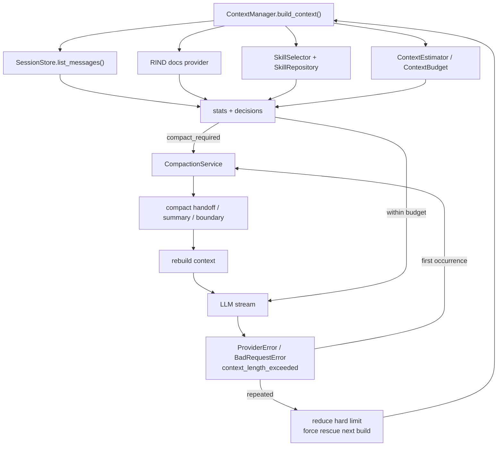

恢复顺序是：第一次 context length error 触发 mid-turn compact；再次失败则降低 context hard limit，并要求下一次 build 走 rescue。非 context length 的 provider error 直接转换为 `turn_failed`。

## 7. 工具执行与持久化顺序

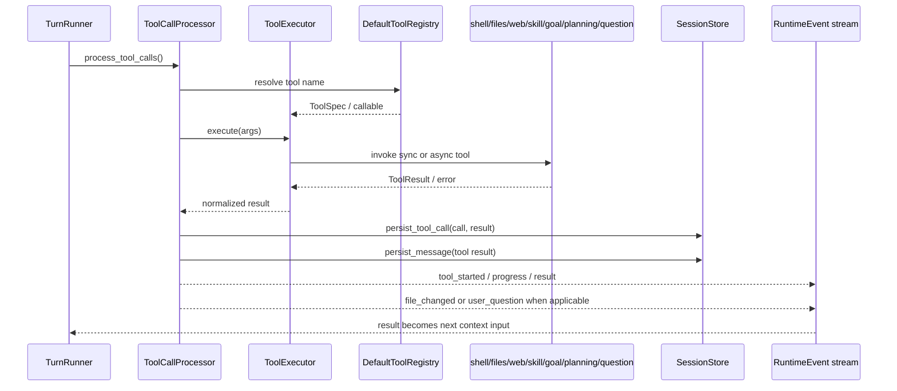

内置工具目录：

- `builtin/shell/`：`tool.py`、`session_pool.py`、`supervisor.py`、`process.py`、`capture.py`、`policy.py`、`process_tree.py`、`result.py`；
- `builtin/files/`：文件读取、写入、编辑和变更记录；
- `builtin/web.py`：网络检索/访问工具；
- `builtin/skill.py`：技能查询和激活；
- `builtin/goal.py`、`builtin/planning.py`：goal/plan 控制；
- `builtin/user_question.py`：将用户问答桥接到 runtime responder。

## 8. Session、控制请求和退出

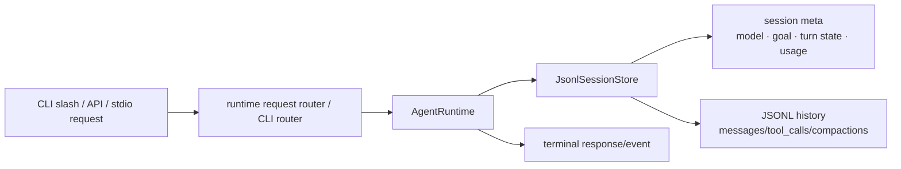

控制请求的主要行为：

| 请求 | runtime 行为 | 是否进入主 turn 队列 |
| --- | --- | --- |
| `initialize` | 初始化 session、返回 resume preview/capabilities | 否 |
| `turn.start` | 启动一次 turn | 是 |
| `turn.interrupt` | 取消 token、丢弃 pending input | 否 |
| `turn.steer` | 加入当前 turn steering queue | 否 |
| `turn.follow_up` | 加入后续 turn queue | 否 |
| `compact` | 调用 `compact_context()` | 控制路径 |
| `model.set` | 更新 runtime client 与 session metadata | 控制路径 |
| `session.switch` | idle 时切换 session 并返回 preview | 控制路径 |
| `goal.*` | 读取、设置、更新或清除 goal | 控制路径 |
| `slash.execute` | readonly 命令立即响应，其余复用 CLI router | 取决于命令 |

## 9. 失败和退出路径

- 参数解析失败：argparse 自己输出错误并退出；
- session id 非法：`main.py` 输出 `Session error`，返回 `1`；
- settings 无效：输出 `Configuration error`，返回 `1`；
- session 初始化/持久化失败：runtime 转换为 `PersistenceError`，产生失败事件；
- provider 非 context 错误：产生 `turn_failed`；
- context 超限：compact -> hard-limit rescue -> 仍失败才终止；
- cancellation：产生 `turn_cancelled`，清理 active turn 和 pending queues；
- CLI Ctrl+C：`ChatCLI` 清理运行时后返回 `130`；
- 正常退出：返回 `0`。

## 10. 从入口跟读代码的路径

```text
main.py
  -> agent/bootstrap/container.py
     -> agent/application/runtime/runtime.py
        -> agent/application/runtime/turn_runner.py
           -> agent/application/context/manager.py
           -> agent/application/runtime/stream_pump.py
           -> agent/application/tools/processor.py
              -> agent/application/tools/executor.py
                 -> agent/infrastructure/tools/builtin/*
           -> agent/infrastructure/persistence/jsonl_session_store.py

CLI output:
  agent/interfaces/cli/chat_cli.py
    -> agent/interfaces/cli/status/*
    -> agent/interfaces/cli/ui/*

stdio/API output:
  agent/interfaces/runtime_server/stdio.py
    -> agent/interfaces/runtime_server/protocol.py
  agent/interfaces/api/routes_session.py
    -> SSE envelope

Node terminal client:
  frontend-cli/bin/rind.js
    -> frontend-cli/lib/runtime-protocol.js
    -> frontend-cli/lib/*state.js / input modules
    -> frontend-cli/lib/rendering.js
```
